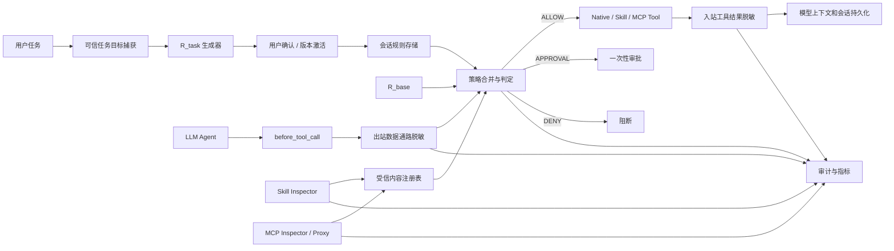
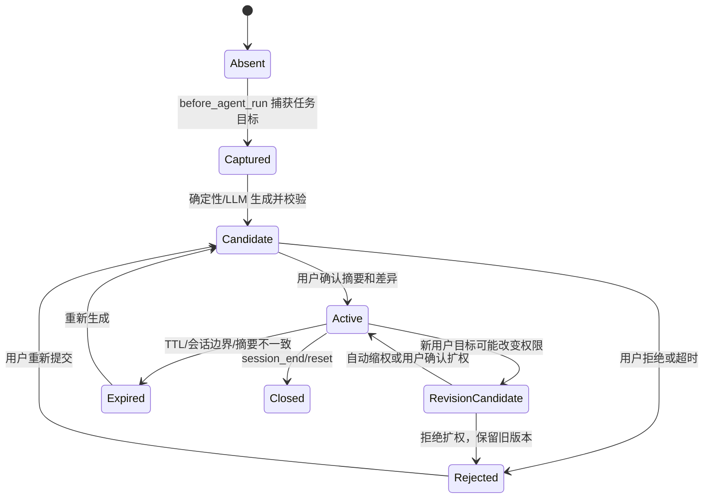
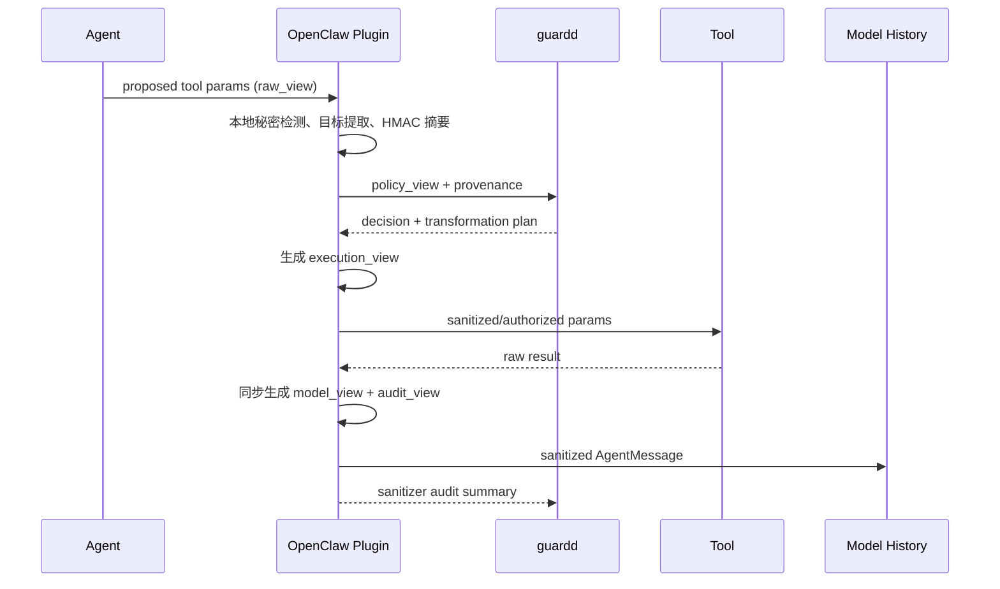
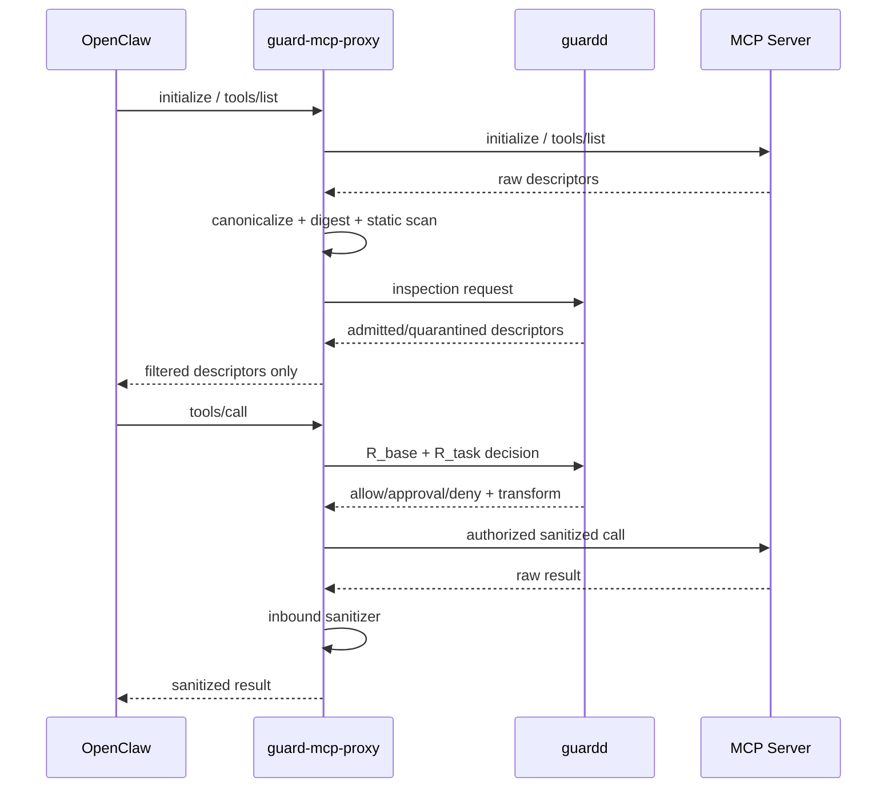

# GuardAgent 会话级 R_task、数据通路脱敏与 Skill/MCP 内容核查实现方案

> 文档状态：Draft v0.1
> 编制日期：2026-07-20
> 适用代码库：GuardAgent 0.1.x
> 目标平台：OpenClaw 2026.7.x 及后续兼容版本
> 参考思想：ClawGuard 的任务规则诱导、工具调用边界授权、双向内容脱敏与 Skill 检查

## 1. 文档目的

本文档定义 GuardAgent 下一阶段的完整实现方案，引入以下三项能力：

1. **会话级 `R_task`**：从可信的用户任务目标中形成会话级最小权限规则，经用户确认后，与不可覆盖的基础规则 `R_base` 合并，在每次工具调用前执行。
2. **真实数据通路脱敏**：不仅保护 GuardAgent 审计数据，还要控制秘密是否进入真实工具参数、外部服务、模型上下文和持久化会话记录。
3. **Skill/MCP 内容核查**：在 Skill 内容或 MCP 工具描述进入模型上下文、首次执行或内容发生变化之前，完成静态检查、能力提取、可选模型复核、用户确认和基于内容摘要的缓存。

本文档是后续编码、接口设计、数据库迁移、测试和验收的技术基线。除非在实现过程中发现 OpenClaw 的真实运行语义与当前 SDK 类型不一致，否则实现应遵循本文档定义的安全不变量、状态机和失败策略。

## 2. 背景与当前差距

GuardAgent 当前已经具备：

- `before_tool_call` 工具执行前拦截；
- `message_sending` 和 `reply_payload_sending` 外发拦截；
- 命令、路径、网络目标归一化；
- 静态 YAML 确定性策略；
- `DENY > REQUIRE_APPROVAL > ALLOW` 决策优先级；
- 一次性审批、SQLite 审计和跨事件关联；
- OpenClaw sandbox、tool policy、exec approvals 和 installPolicy 基线；
- 服务断连时的嵌入式失败关闭策略。

但与论文思想相比，当前实现仍有三个关键缺口。

### 2.1 当前策略是部署级规则，不是任务级授权

现有 `policies/default.yaml` 可以允许整个工作区的普通读写。它能回答“这个动作是否符合长期主机安全规则”，但不能精确回答“这个动作是否是本次任务所必需的”。

例如，用户只要求写入 `reports/summary.md`，间接提示注入却诱导 agent 修改 `README.md`。两个路径都在工作区内，现有静态策略可能允许后者；会话级 `R_task` 应把写入权限限制到 `reports/summary.md`。

### 2.2 当前脱敏主要保护控制面和审计面

当前 TypeScript 插件会在向 `guardd` 提交事件之前对参数副本脱敏，Python 服务也会对审计内容再次脱敏。但除非策略显式返回 `rewritten_params`，真实工具调用仍使用原始参数；`after_tool_call` 也只记录结果，不能修改进入下一轮模型上下文的工具结果。

因此，需要明确区分：

- **策略视图**：供 GuardAgent 判定使用；
- **执行视图**：实际交给工具的参数；
- **模型视图**：工具结果进入 LLM 前的内容；
- **审计视图**：可安全持久化的摘要。

### 2.3 当前 Skill 安装控制不是内容语义核查

当前 installPolicy 主要验证目标 allowlist、来源、registry、精确版本和可变性。这是供应链来源控制，但不能识别以下问题：

- `SKILL.md` 中混入的越权指令；
- Skill 脚本读取凭据并外发；
- MCP tool description 中的提示注入；
- MCP input schema/default/example 中隐藏的指令；
- 同名工具在重新连接后悄悄改变描述或能力；
- 已安装内容被本地修改后继续复用旧审批。

## 3. 目标、非目标与威胁模型

### 3.1 建设目标

本阶段必须实现以下安全性质：

1. 在第一次真实工具调用前，建立当前会话的有效 `R_task`，或以保守默认策略处理。
2. `R_task` 只能缩小或补充明确授权，永远不能覆盖 `R_base` 的拒绝项。
3. 外部工具调用不得在未经授权的情况下携带秘密。
4. 工具结果中的秘密必须在进入后续模型上下文和会话持久化之前被处理。
5. 新增或变更的 Skill/MCP 内容不得在未完成核查时进入受信任执行路径。
6. 所有规则生成、确认、脱敏和内容核查事件必须可解释、可审计、可回放。
7. 任一新组件失败时，不得退化为比当前 GuardAgent 更宽松的行为。

### 3.2 非目标

本阶段不试图：

- 从自然语言中证明用户真实意图；
- 用正则或分类器彻底删除所有提示注入文本；
- 替代 OpenClaw sandbox、tool policy、exec approvals 或操作系统隔离；
- 对任意脚本语言做完整语义证明；
- 自动永久信任模型判定为“安全”的第三方 Skill/MCP；
- 允许 LLM 自动修改 `R_base`；
- 保护已被管理员完全攻陷或主动关闭安全控制的 Gateway。

### 3.3 威胁来源

新增能力主要应对：

- 网页、邮件、文档、搜索结果和工具返回中的间接提示注入；
- Skill 文档和脚本中的恶意或越权行为；
- MCP tool description、schema、prompt、resource 和 tool result 投毒；
- 模型因任务理解错误而扩大权限；
- 秘密在工具参数、URL、Header、消息、附件或工具结果中传播；
- 内容更新后继续复用旧信任结论；
- 使用编码、Unicode、字符串拼接或跨步骤行为规避单次检查。

## 4. 总体架构



新增模块建议如下：

```text
guardd/
  task_policy/
    models.py
    schema.json
    synthesizer.py
    validator.py
    manager.py
    merger.py
  sanitization/
    patterns.py
    schema.json
    engine.py
    provenance.py
  inspection/
    models.py
    static_scanner.py
    capability_extractor.py
    llm_reviewer.py
    manager.py
    cache.py
  api/
    task_policy.py
    inspection.py
    sanitization.py

plugins/guard-openclaw/src/
  task-policy.ts
  sanitizer.ts
  content-registry.ts
  mcp-identity.ts

proxies/guard-mcp-proxy/
  src/
    transport.ts
    inspector.ts
    policy-client.ts
    sanitizer.ts
```

不要求第一阶段一次性创建所有文件，但职责边界必须保持清晰，避免继续把任务规则、脱敏和内容核查全部堆入 `guardd/service.py` 或插件 `index.ts`。

## 5. 安全不变量

以下不变量必须通过代码断言和测试固定下来。

### 5.1 规则不变量

1. `R_effective = R_base ∪ R_task ∪ R_correlation`。
2. 任一层给出 `DENY`，最终结果必须是 `DENY`。
3. `R_task` 不得覆盖 `R_base` 的拒绝规则、受保护路径、网络边界和安全配置保护。
4. 缺少 `R_task`、`R_task` 过期、摘要不匹配或状态不明确时，不得自动扩大权限。
5. `R_task` 的权限扩展必须由用户确认；自动更新只能保持或缩小权限。
6. 子智能体的有效权限必须是父会话权限与子任务权限的交集。

### 5.2 数据不变量

1. 原始秘密不得进入 SQLite、普通日志、SSE、UI URL、错误堆栈或模型复核提示。
2. 跨进程传递秘密摘要时使用带密钥 HMAC 或事件级不可关联摘要，不使用可被字典枚举的裸 SHA-256 作为唯一保护。
3. `sanitized_params` 不能被误认为真实执行参数；真实改写必须通过明确的 `execution_params`/`rewritten_params` 返回。
4. 工具结果脱敏必须发生在下一轮模型读取之前；仅在 `after_tool_call` 中记录不满足该要求。
5. 脱敏失败时，外部出站默认阻断，入站内容默认替换为安全占位说明，不得回退为原文。

### 5.3 内容信任不变量

1. Skill/MCP 的信任键必须包含内容摘要，不能只按名称缓存。
2. 内容摘要、扫描器版本、基础策略摘要或模型复核提示版本变化时，旧结论失效。
3. LLM 复核只能产生候选风险结论，不能覆盖静态 critical finding 或 `R_base`。
4. “全局内容安全”不等于“当前任务授权”；Skill/MCP 首次调用仍要满足 `R_task`。
5. 未经检查的 MCP 描述不得进入模型的工具列表；若平台缺少该拦截点，必须通过代理或上游扩展解决，不能只依赖 `before_tool_call`。

## 6. 工作一：会话级 R_task

### 6.1 定义

`R_task` 是绑定到一个 GuardAgent session 的、带版本和确认状态的最小权限规则集合。它只描述完成当前用户目标所需的权限，不承载组织级不可变安全策略。

建议的逻辑结构：

```json
{
  "schema_version": "1.0",
  "task_policy_id": "uuid",
  "session_key": "sha256:...",
  "revision": 1,
  "status": "candidate",
  "objective": {
    "summary": "汇总指定博客并写入 reports/summary.md",
    "source_digest": "hmac-sha256:..."
  },
  "tools": {
    "allow": ["web_fetch", "read", "write"],
    "deny": ["exec", "process", "message_send", "sessions_spawn"]
  },
  "files": {
    "read": [],
    "write": ["${WORKSPACE}/reports/summary.md"],
    "deny": []
  },
  "network": {
    "read": ["pastebin.com"],
    "write": [],
    "deny": []
  },
  "commands": {
    "allow_prefixes": [],
    "deny_prefixes": [],
    "approval_categories": ["dynamic_eval", "package_install"]
  },
  "skills": {
    "allow_digests": [],
    "deny_names": []
  },
  "mcp": {
    "allow_tools": [],
    "allow_descriptor_digests": []
  },
  "limits": {
    "max_tool_calls": 30,
    "max_external_writes": 0,
    "max_files_changed": 1,
    "expires_at": "2026-07-20T12:00:00Z"
  },
  "provenance": {
    "generator": "deterministic+llm",
    "generator_version": "1",
    "model": "optional-provider/model",
    "prompt_digest": "sha256:..."
  }
}
```

### 6.2 可信任务目标 `H0`

论文依赖“在外部工具输出污染上下文之前生成任务规则”。GuardAgent 应把可信输入边界定义得更严格。

允许进入规则生成器的内容：

- 当前用户直接提交的 prompt；
- 可信的 sender/channel/agent/session 元数据；
- 用户显式选择的附件名称、类型、大小和本地路径元数据；
- 操作者配置的 workspace、工具清单和组织级约束；
- 已激活 `R_task` 的摘要，用于后续任务修订。

默认禁止进入规则生成器的内容：

- 历史 tool result；
- 网页、邮件、文档正文；
- Skill 内容；
- MCP tool description、schema、prompt 和 resource；
- agent 自己生成的计划或解释；
- 未经可信来源标记的系统上下文片段。

`before_agent_run` 当前提供用户 prompt、历史 messages 和 systemPrompt。实现时只捕获当前 prompt 和可信元数据，不应直接把完整 `messages` 或 `systemPrompt` 交给规则生成器。

### 6.3 生成策略

采用“确定性提取优先，可选 LLM 补全”的两阶段生成器。

#### 阶段 A：确定性提取

从用户 prompt 和可信附件元数据中提取：

- 明确出现的绝对/相对路径；
- 明确域名和 URL；
- 明确工具或动作，例如“读取”“写入”“发送邮件”“提交表单”；
- 数量边界，例如“三个文件”“只修改一个配置”；
- 输出目标；
- 明确禁止项，例如“不要联网”“只读”。

确定性提取结果直接形成约束下界，不允许 LLM 删除用户明确提出的限制。

#### 阶段 B：可选 LLM 补全

LLM 只能：

- 将高层目标映射为候选工具类别；
- 补充必要但未显式写出的只读步骤；
- 对不确定权限标记 `requires_confirmation`；
- 输出严格 JSON，不输出自由文本规则。

LLM 不得：

- 使用工具；
- 读取外部内容；
- 把 `*` 作为默认路径或域名；
- 生成覆盖 `R_base` 的规则；
- 自动激活候选规则；
- 把未知目标推断为允许。

生成完成后必须经过 JSON Schema、路径规范化、域名规范化、工具存在性、规则包含关系和 `R_base` 冲突校验。

### 6.4 状态机



状态含义：

- `absent`：尚未看到可信用户目标。
- `captured`：目标已捕获，尚未生成规则。
- `candidate`：规则已生成并校验，等待确认。
- `active`：可参与执行判定的唯一状态。
- `revision_candidate`：新任务可能改变权限，旧 active 规则仍有效但不得自动扩权。
- `rejected`：候选规则被拒绝或确认超时。
- `expired`：TTL、会话迁移、策略更新或依赖摘要变化导致失效。
- `closed`：会话结束，不再接受调用。

### 6.5 生成与确认时机

建议采用“提前捕获、首次调用前完成生成和确认”的实现：

1. `before_agent_run` 只捕获并保存可信用户目标，操作必须快速且不调用外部模型。
2. 后台或独立长超时请求生成候选 `R_task`。
3. 第一次 `before_tool_call` 到达时：
   - 若候选已生成，进入确认；
   - 若仍在生成，在限定时间内等待；
   - 若生成失败，使用保守默认，不得自动赋予宽权限。
4. 用户确认后原子激活候选规则，再重新判定当前工具调用。

规则激活后，插件可以通过 `before_prompt_build` 向 agent 注入一份脱敏、只读的权限摘要，帮助模型减少无效工具尝试。该摘要只用于行为提示，不能作为授权来源；真正的执行许可始终以 guardd 中的 active revision 和摘要绑定为准。即使模型忽略、篡改或遗忘该摘要，工具边界仍必须执行同一份 `R_task`。

确认通道：

- 本地 Web 控制台作为完整规则审阅主通道；
- OpenClaw 原生 `requireApproval` 作为行内确认通道，展示规则摘要、权限扩张点、候选摘要和有效期；
- CLI 可用于运维确认，但能否恢复正在等待的真实调用必须以 Gateway 端到端验证为准。

行内审批描述长度有限，因此不得只显示“是否允许”。至少应显示：

- 新增工具；
- 新增路径；
- 新增网络目标；
- 是否允许外部写入；
- 规则摘要前 12～16 位；
- 完整详情的本地 UI 引用 ID。

### 6.6 多轮任务修订

每次新的用户 prompt 都可能是：

- 对原任务的说明，不改变权限；
- 缩小任务范围；
- 扩大任务范围；
- 完全切换任务。

处理原则：

1. 权限集合不变：更新目标摘要，不创建新版本。
2. 纯缩权：可以自动生成并激活新 revision，但必须审计。
3. 扩权：创建 `revision_candidate`，必须用户确认。
4. 任务切换：关闭旧任务规则并创建新候选；未确认前不复用旧权限完成新任务。
5. 无法可靠判断是否扩权：按扩权处理。

权限集合比较必须基于规范化后的工具、路径、域名和能力集合，不能比较原始 JSON 字符串。

### 6.7 子智能体继承

子智能体权限必须满足：

```text
R_child_effective = R_base ∪ (R_parent_task ∩ R_child_task) ∪ R_child_correlation
```

要求：

- 子任务未生成 `R_child_task` 时，默认继承父权限的只读子集；
- 子智能体不能因换 session_key 获得更宽权限；
- 父规则失效或关闭时，所有子规则同步失效；
- `sessions_spawn` 本身仍受基础策略和一次性审批控制；
- 子任务需要父规则之外的权限时，审批必须回到原始用户/操作者。

### 6.8 规则合并与决策算法

每个工具调用先形成规范化属性：

```text
A = {
  tool identity,
  command AST/features,
  resolved paths + access modes,
  network destinations + directions,
  content artifact identity,
  data classifications,
  budgets and correlation state
}
```

然后分别计算：

```text
V_base(A)        -> ALLOW | APPROVAL | DENY | NO_MATCH
V_task(A)        -> ALLOW | APPROVAL | DENY | OUT_OF_SCOPE
V_correlation(A) -> ALLOW | APPROVAL | DENY | NO_MATCH
```

合并规则：

```text
if any verdict == DENY:
    DENY
else if V_task == OUT_OF_SCOPE:
    REQUIRE_APPROVAL or DENY according to task_policy.out_of_scope
else if any verdict == APPROVAL:
    REQUIRE_APPROVAL
else if V_task != ALLOW:
    REQUIRE_APPROVAL
else:
    ALLOW
```

`R_task` 的 allow 只表示“属于本次任务”，并不意味着可绕过 `R_base` 或原生安全层。

### 6.9 API 设计

建议增加：

```text
POST /v1/task-policies/capture
POST /v1/task-policies/prepare
GET  /v1/task-policies/{session_key}
GET  /v1/task-policies/{session_key}/candidate
POST /v1/task-policies/{session_key}/activate
POST /v1/task-policies/{session_key}/reject
POST /v1/task-policies/{session_key}/revise
POST /v1/task-policies/{session_key}/close
POST /v1/task-policies/simulate
```

关键并发控制：

- 激活请求必须携带 `candidate_digest` 和 `expected_active_revision`；
- 激活在数据库事务内完成；
- 同一 session 同时只能有一个 active revision；
- 第一次工具调用绑定它所判定的 active revision；
- 审批完成时必须重新验证 candidate digest、session、agent、sender 和当前基础策略摘要。

### 6.10 数据库设计

建议新增表：

```sql
task_policies(
  task_policy_id TEXT PRIMARY KEY,
  session_key TEXT NOT NULL,
  revision INTEGER NOT NULL,
  status TEXT NOT NULL,
  source_digest TEXT NOT NULL,
  policy_digest TEXT NOT NULL,
  base_policy_digest TEXT NOT NULL,
  sanitized_objective_json TEXT NOT NULL,
  policy_json TEXT NOT NULL,
  generator_json TEXT NOT NULL,
  created_at TEXT NOT NULL,
  activated_at TEXT,
  expires_at TEXT,
  closed_at TEXT,
  UNIQUE(session_key, revision)
);

task_policy_confirmations(
  confirmation_id TEXT PRIMARY KEY,
  task_policy_id TEXT NOT NULL,
  operator TEXT NOT NULL,
  decision TEXT NOT NULL,
  candidate_digest TEXT NOT NULL,
  previous_digest TEXT,
  diff_json TEXT NOT NULL,
  created_at TEXT NOT NULL
);
```

`policy_json` 不得保存原始用户 prompt；目标只保存脱敏摘要、分类和带密钥 digest。

## 7. 工作二：真实数据通路脱敏

### 7.1 目标模型

数据通路不能再只有“原始参数”和“sanitized_params”两个模糊概念。建议定义四种显式视图：

| 视图 | 用途 | 是否可含原始秘密 | 是否持久化 |
|---|---|---:|---:|
| `raw_view` | Gateway Hook 内短暂分析 | 可以，仅限内存 | 否 |
| `policy_view` | `guardd` 策略判定 | 默认不可以 | 仅保存摘要 |
| `execution_view` | 真实工具调用 | 仅经显式策略允许 | 否 |
| `model_view` | 工具结果进入模型 | 不可以，除非声明为受信本地模型且策略明确允许 | 会话可保存脱敏后内容 |
| `audit_view` | SQLite/UI/日志 | 不可以 | 是 |

核心流程：



### 7.2 为什么检测必须部分内嵌在插件

OpenClaw 当前 `tool_result_persist` Hook 是同步 Hook，不能等待远程 API 或 LLM。为了保证工具结果在进入持久化和下一轮模型上下文前完成处理，必须把核心脱敏器以本地同步代码放在 TypeScript 插件内。

`guardd` 负责：

- 维护规范化的模式和策略版本；
- 返回出站 transformation plan；
- 保存脱敏摘要和指标；
- 提供 UI 和策略管理；
- 对离线样本执行更重的复核。

插件负责：

- 对原始参数进行第一遍本地检测；
- 确保原始秘密不离开 Gateway；
- 根据 transformation plan 构造真实执行参数；
- 在 `tool_result_persist` 中同步改写 AgentMessage；
- 在服务不可用时执行嵌入式最低安全策略。

Python 与 TypeScript 不应分别手工维护两套长期漂移的正则。建议把基础模式放入版本化 JSON，例如：

```text
config/sanitization-patterns.json
```

构建时生成或加载到两端，并对 pattern digest 做一致性检查。

HMAC 使用独立于 API bearer token 的随机密钥，保存在 GuardAgent 状态目录并采用与 token 文件相同或更严格的权限。轮换 HMAC 密钥后，旧摘要只用于历史审计，不能继续绑定新的审批、secret handle 或执行许可。

### 7.3 出站参数处理

对每个字段产生以下分类：

```json
{
  "json_path": "$.headers.Authorization",
  "classification": "bearer_token",
  "length": 128,
  "digest": "hmac-sha256:...",
  "source": "field-name+value-pattern",
  "destination": "api.example.com",
  "proposed_action": "redact"
}
```

支持的动作：

- `preserve`：只允许受信本地工具或明确批准的目标；
- `redact`：替换为类型化占位符；
- `drop`：删除整个字段或附件；
- `late_bind`：替换为本地 secret handle，由受信执行适配器在最后一跳解析；
- `block`：无法安全转换或转换会改变安全语义时阻断；
- `require_approval`：目的地和任务均明确，但涉及真实秘密传递时逐次审批。

决策必须同时考虑：

- 数据分类；
- 工具身份和内容摘要；
- 目的地域名、端口和方向；
- `R_base`；
- `R_task`；
- 当前会话最近的敏感读取；
- 工具是否支持 late binding；
- 用户是否批准本次精确参数摘要。

### 7.4 Late binding 与可用性

简单把所有秘密替换为 `<SECRET>` 会破坏合法认证流程。建议逐步引入 late binding：

```text
真实 secret
  -> Gateway 内存中的短期 handle
  -> execution_params 中使用 guard-secret://<opaque-id>
  -> 受信工具适配器在实际网络发送前解析
  -> handle 单次使用、绑定 tool/destination/session/TTL
```

安全要求：

- handle 使用强随机值，不包含 secret 摘要；
- 只能由本机受信适配器解析；
- 绑定精确目标域名、工具身份和参数 digest；
- 默认单次使用并短时过期；
- 不进入模型、审计或外部工具描述；
- 解析失败时阻断，不回传原始 secret。

第一阶段可以不实现通用 late binding，但必须明确支持范围：

- 对外部通用工具：秘密默认 block/redact；
- 对本地受信工具：可按精确工具和目标配置 preserve；
- 对需要认证的 MCP/HTTP：在代理层实现 late binding 后再开放。

### 7.5 入站工具结果处理

主 Hook 使用 `tool_result_persist`，因为其返回值允许改写 `AgentMessage`。`after_tool_call` 继续用于时延、错误和原始结果大小等观测，但不能作为模型通路脱敏的安全边界。

`before_message_write` 可作为会话持久化的第二道防线，但不能替代 `tool_result_persist` 的工具结果语义处理。

入站处理规则：

1. 递归遍历结构化 text/content blocks。
2. 对纯文本执行字段无关和上下文相关模式检测。
3. 对 URL query、Header、连接串、PEM、token、个人身份信息等生成类型化占位符。
4. 对二进制或未知 MIME：只保留安全元数据，原内容进入隔离区或直接阻断进入模型。
5. 对超大结果：在固定字节上限内扫描和截断，并明确标记截断；不得因超限直接放行未扫描尾部。
6. 对匹配到的秘密记录分类、计数和 HMAC 摘要，不记录原文。
7. 保留工具调用是否成功等结构，不把脱敏错误伪装成工具成功结果。

建议占位符格式：

```text
<GUARD_REDACTED type="github_token" length="40" ref="event-local-3">
```

`ref` 只在当前事件内唯一，不应成为跨会话追踪 secret 的稳定标识。

### 7.6 提示注入与数据脱敏的边界

数据脱敏不应宣称可以删除所有间接提示注入。对于工具返回中的自然语言指令，应增加来源标签和不可信边界，例如：

```text
<UNTRUSTED_TOOL_CONTENT tool="web_fetch" source="https://example.com/...">
...
</UNTRUSTED_TOOL_CONTENT>
```

该标签用于帮助模型理解来源，但真正的安全控制仍由 `R_task` 和工具边界判定完成。不得因为检测不到“ignore previous instructions”就认为内容可信。

### 7.7 Provenance 数据

每个进入策略或模型的数据块应携带：

- `source_kind`：user/tool/skill/mcp/resource/system；
- `source_identity`：脱敏后的工具或内容摘要；
- `trust_level`：trusted_user/trusted_operator/untrusted_external/inspected_content；
- `sanitization_policy_digest`；
- `transformations`；
- `original_size` 和 `result_size`；
- `truncated`；
- `content_digest`，仅对已脱敏内容计算。

### 7.8 API 与事件模型调整

建议把 GuardEvent 升级为向后兼容的 `1.1`，增加可选字段：

```json
{
  "task_policy": {
    "id": "uuid",
    "revision": 1,
    "digest": "sha256:..."
  },
  "content_identity": {
    "kind": "native|skill|mcp",
    "name": "tool-name",
    "digest": "sha256:..."
  },
  "provenance": [],
  "sanitization": {
    "pattern_digest": "sha256:...",
    "classifications": [],
    "transformation_digest": "sha256:..."
  }
}
```

Decision 增加：

```json
{
  "execution_params": {},
  "transformation_plan": [],
  "task_policy_digest": "sha256:...",
  "content_verdict_digest": "sha256:..."
}
```

为避免兼容混乱，可以保留 `rewritten_params` 一段时间，但插件必须优先使用新的 `execution_params`，并在两者同时出现且不一致时失败关闭。

建议增加审计 API：

```text
POST /v1/events/sanitization
GET  /v1/ui/sanitization/events
GET  /v1/ui/sanitization/metrics
```

### 7.9 数据库设计

```sql
sanitization_events(
  sanitizer_event_id TEXT PRIMARY KEY,
  event_id TEXT,
  session_key TEXT NOT NULL,
  direction TEXT NOT NULL,
  tool_name TEXT,
  content_digest TEXT,
  pattern_digest TEXT NOT NULL,
  classifications_json TEXT NOT NULL,
  transformations_json TEXT NOT NULL,
  original_size INTEGER NOT NULL,
  result_size INTEGER NOT NULL,
  blocked INTEGER NOT NULL,
  truncated INTEGER NOT NULL,
  created_at TEXT NOT NULL
);
```

表中禁止出现原始秘密或稳定的无密钥 secret hash。

### 7.10 失败策略

| 场景 | 行为 |
|---|---|
| 插件秘密检测器抛错 | 外部出站阻断；本地只读按应急策略处理 |
| `guardd` 不可用 | 插件本地规则阻断秘密外发；不允许 preserve/late_bind 新授权 |
| transformation plan 摘要不匹配 | 阻断 |
| 工具结果无法解析 | 用安全错误占位替换，不向模型传原文 |
| 工具结果超过上限 | 扫描前缀、截断、标记；敏感工具可直接隔离 |
| 二进制未知内容 | 不进入模型，保留类型/大小/摘要元数据 |
| `tool_result_persist` 未在下一轮模型读取前执行 | 视为平台能力门禁失败，不启用“入站通路已保护”声明 |

## 8. 工作三：Skill/MCP 内容核查

### 8.1 总体原则

内容核查采用四层模型：

```text
来源可信度检查
  -> 内容摘要和文件系统安全检查
  -> 静态风险扫描与能力提取
  -> 可选 LLM 语义复核
  -> 用户确认 / 注册 / 运行时任务匹配
```

核查结论分为：

- `ALLOW`：内容本身未发现阻断项，但运行时仍受 `R_task`；
- `REQUIRE_APPROVAL`：存在不确定或高能力行为，需要用户确认；
- `DENY`：静态 critical、来源不可信、摘要不一致或明确恶意；
- `QUARANTINE`：内容需要隔离分析，不能进入模型或执行路径；
- `STALE`：旧结论因内容/策略/扫描器变化失效。

### 8.2 内容身份与缓存键

缓存键必须至少包含：

```text
artifact_kind
+ canonical_identity
+ content_digest
+ scanner_version
+ inspection_policy_digest
+ llm_prompt_digest (if used)
+ llm_model_id (if used)
```

Skill 的 `content_digest` 应覆盖：

- `SKILL.md`；
- manifest；
- 所有可执行脚本；
- 被引用的本地资源；
- 文件路径、模式、权限和大小；
- symlink/hardlink 信息；
- 规范化后的压缩包成员列表。

MCP descriptor digest 应覆盖：

- server identity；
- tool name；
- description；
- input schema；
- annotations、examples、default；
- server/version/protocol capabilities；
- transport 和配置身份。

### 8.3 Skill 核查接入点

#### 安装前

`before_install` 已提供：

- `sourcePath`；
- targetType/targetName；
- request/source 信息；
- OpenClaw builtinScan 结果和 findings。

插件应把安全的文件清单、摘要、builtin findings 和静态扫描结果提交到新接口：

```text
POST /v1/inspections/skill
```

不能把未经限制的全部 Skill 原文直接写入审计或交给远程 LLM。

#### Gateway 启动与周期复核

仅在安装时检查不足以发现：

- 手工复制的 Skill；
- 安装后修改；
- 磁盘恢复或分支切换；
- 扫描器规则更新后的新 finding。

因此需要：

- Gateway 启动时扫描启用的 Skill；
- 文件监听只用于触发重新扫描，不作为唯一完整性保证；
- 首次执行前重新计算快速摘要；
- 定期低频全量复核；
- 摘要变化立即将旧 verdict 标记为 `STALE`。

#### 首次执行

Skill 首次执行前必须同时满足：

1. 当前内容摘要有有效 inspection verdict；
2. verdict 不是 DENY/QUARANTINE/STALE；
3. Skill 声明能力属于当前 `R_task`；
4. 实际工具调用参数仍通过正常 `before_tool_call`；
5. 若 Skill 内容或能力超出用户确认范围，触发一次性审批。

### 8.4 Skill 静态扫描

至少覆盖：

- 提示模型忽略系统、用户或安全规则；
- 要求隐藏行为、删除日志或避免告知用户；
- 凭据和敏感路径访问；
- 网络外发、上传、Webhook、消息发送；
- shell、动态解释器、编码执行、下载后执行；
- 自修改 GuardAgent/OpenClaw 配置；
- 持久化、提权、进程和容器控制；
- Unicode bidi、零宽字符、同形异义字符；
- Base64/hex/压缩嵌入的大段指令或脚本；
- symlink/hardlink、路径逃逸和压缩炸弹；
- 二进制、宏、安装脚本和未知可执行文件；
- 描述能力与脚本实际能力不一致；
- 将外部内容重新解释为系统指令的模板。

静态 finding 必须包含：

```json
{
  "rule_id": "SKILL-SECRET-READ-001",
  "severity": "critical",
  "file": "scripts/run.py",
  "line": 42,
  "evidence_digest": "hmac-sha256:...",
  "message": "读取 SSH 私钥并构造外部请求",
  "capability": "credential_read+network_write"
}
```

### 8.5 能力提取

内容核查不仅输出“安全/不安全”，还要产生可与 `R_task` 比较的 capability manifest：

```json
{
  "tools": ["read", "write", "exec", "web_fetch"],
  "file_read_patterns": ["${WORKSPACE}/**"],
  "file_write_patterns": ["${WORKSPACE}/output/**"],
  "network_read": ["api.example.com"],
  "network_write": [],
  "commands": ["python", "git"],
  "dynamic_execution": false,
  "secret_access": false,
  "persistence": false,
  "subagent": false
}
```

当静态分析无法确定目标时，应标为 unknown capability，而不是省略。unknown 在运行时映射为审批或拒绝。

### 8.6 可选 LLM 复核

LLM 复核用于识别静态规则难以判断的语义问题，例如：

- 把偏见或错误评价标准伪装为合法编辑指导；
- 通过多段自然语言组合诱导越权；
- 描述与实现不一致；
- 任务无关的隐藏行为。

LLM 输入必须：

- 明确把内容标记为不可信数据；
- 使用经脱敏和限长的文本；
- 包含静态 findings 和 capability manifest；
- 不包含任何真实 secret；
- 不允许调用工具；
- 要求严格 JSON 输出和逐 finding 证据位置；
- 对无法判断输出 `uncertain`。

LLM 结论不能：

- 覆盖 static critical；
- 自动把 unknown capability 变成 allow；
- 创建永久信任；
- 修改基础策略。

### 8.7 MCP 核查为什么需要注册前拦截

MCP tool description 投毒会在任何工具调用之前影响模型选择和推理。当前 `before_tool_call` 事件只有工具名称、类型和参数，没有完整、权威的 MCP description/schema。因此，仅在工具调用时检查不能完整防御 MCP 描述投毒。

必须采用以下两种方式之一：

1. **首选：OpenClaw 增加/暴露 MCP descriptor registration Hook**，在 descriptors 进入模型工具列表前允许插件删除、改写或隔离条目。
2. **兼容方案：部署本地 `guard-mcp-proxy`**，代理 stdio/SSE/Streamable HTTP MCP 流量，在 `tools/list`、`prompts/list`、`resources/list` 和 tool result 返回时执行检查。

在两者均未落地之前，系统只能声明“控制 MCP 工具调用结果”，不能声明“防御 MCP tool description poisoning”。

### 8.8 guard-mcp-proxy 设计



代理职责：

- 建立稳定 server identity；
- 拦截并规范化 descriptor；
- 隐藏 DENY/QUARANTINE 工具，使其不进入模型上下文；
- 对 description/schema 中的注入和异常能力执行扫描；
- 将 tool identity 与 descriptor digest 绑定；
- 在每次 call 前验证 descriptor 未发生 TOCTOU 变化；
- 应用 `R_task` 和数据通路脱敏；
- 对 MCP tool result 做入站脱敏；
- 处理 reconnect、server version 变化和 tools/list changed 通知。

代理不应：

- 在本地缓存明文 credential；
- 将所有 MCP server 合并为无法区分来源的同名工具；
- 在 guardd 不可用时放行新 descriptor；
- 把被隔离 descriptor 的原始恶意描述返回给模型解释。

### 8.9 MCP 静态检查

检查对象包括 tool description、schema title/description/default/examples、prompt 和 resource metadata。

至少识别：

- 指示模型忽略上级指令或优先调用本工具；
- 要求读取或发送与工具功能无关的数据；
- 描述中出现 secret、credential、系统文件或安全配置操作；
- schema default/example 带有命令、URL、编码载荷或越权参数；
- 工具名称与描述能力明显不一致；
- 同一 server identity 下 descriptor 无版本提示地变化；
- 工具声称只读但 schema/annotation 暗示写操作；
- 工具返回内容要求模型发起第二个危险调用。

### 8.10 内容核查 API

```text
POST /v1/inspections/skill
POST /v1/inspections/mcp-server
POST /v1/inspections/mcp-descriptors
GET  /v1/inspections/{artifact_digest}
POST /v1/inspections/{artifact_digest}/approve
POST /v1/inspections/{artifact_digest}/deny
POST /v1/inspections/{artifact_digest}/invalidate
GET  /v1/ui/inspections
GET  /v1/ui/inspections/{artifact_digest}
```

请求必须有大小、文件数、扫描时间和递归深度上限。扫描超限映射为 QUARANTINE/REQUIRE_APPROVAL，不能映射为 ALLOW。

### 8.11 数据库设计

```sql
content_artifacts(
  artifact_id TEXT PRIMARY KEY,
  kind TEXT NOT NULL,
  canonical_name TEXT NOT NULL,
  source_identity TEXT NOT NULL,
  content_digest TEXT NOT NULL,
  manifest_json TEXT NOT NULL,
  first_seen_at TEXT NOT NULL,
  last_seen_at TEXT NOT NULL,
  UNIQUE(kind, source_identity, content_digest)
);

inspection_verdicts(
  verdict_id TEXT PRIMARY KEY,
  artifact_id TEXT NOT NULL,
  status TEXT NOT NULL,
  decision TEXT NOT NULL,
  risk TEXT NOT NULL,
  scanner_version TEXT NOT NULL,
  inspection_policy_digest TEXT NOT NULL,
  llm_reviewer_json TEXT,
  findings_json TEXT NOT NULL,
  capability_manifest_json TEXT NOT NULL,
  created_at TEXT NOT NULL,
  expires_at TEXT
);

content_confirmations(
  confirmation_id TEXT PRIMARY KEY,
  verdict_id TEXT NOT NULL,
  operator TEXT NOT NULL,
  decision TEXT NOT NULL,
  scope TEXT NOT NULL,
  created_at TEXT NOT NULL
);
```

用户确认 scope 建议仅允许：

- `allow-once`；
- `allow-for-session`；
- `allow-this-digest`。

不建议提供不绑定摘要的 `allow-by-name`。

## 9. 三项能力的联动

三项工作不能作为互不相干的功能分别放行。一个工具调用的完整判定顺序应为：

```text
1. 识别 tool/native/skill/mcp 身份和内容摘要
2. 验证 Skill/MCP inspection verdict
3. 从 raw_view 构造 policy_view 和 provenance
4. 执行 R_base
5. 执行 R_task
6. 执行 correlation/budget
7. 计算秘密 transformation plan
8. 合并为 ALLOW / REQUIRE_APPROVAL / DENY
9. 构造 execution_view 并执行
10. 对结果构造 model_view 和 audit_view
11. 更新会话状态、预算和审计
```

典型结果：

| 内容安全 | 属于 R_task | 数据流安全 | 最终结果 |
|---|---|---|---|
| 是 | 是 | 是 | ALLOW |
| 是 | 否 | 是 | REQUIRE_APPROVAL/DENY |
| 未知 | 是 | 是 | REQUIRE_APPROVAL |
| 否 | 任意 | 任意 | DENY |
| 是 | 是 | 秘密将发往未授权目标 | DENY |
| 是 | 是 | 需要受信 late binding | ALLOW/APPROVAL，取决于精确授权 |

## 10. UI 和 CLI 设计

### 10.1 会话页面

增加：

- 当前任务目标脱敏摘要；
- `R_task` 状态、revision、摘要和有效期；
- `R_base` 与 `R_task` 的合并视图；
- 候选版本差异；
- 超出任务范围的事件；
- 子智能体权限继承关系；
- 激活、拒绝和关闭记录。

### 10.2 审批页面

区分审批类型：

- 单次工具调用；
- `R_task` 首次激活；
- `R_task` 扩权修订；
- Skill/MCP 内容摘要确认；
- secret preserve/late_bind。

审批卡必须显示“授权对象”和“授权持续时间”，避免用户把会话级授权误解为单次工具授权。

### 10.3 内容核查页面

建议新增“内容核查”页面：

- Skill/MCP artifact 列表；
- 当前摘要与上次摘要；
- 来源、版本、扫描时间和缓存状态；
- findings、能力清单和模型复核结论；
- 当前哪些 session 正在使用；
- approve/deny/invalidate；
- descriptor 或 Skill 更新差异。

### 10.4 脱敏观测

只展示：

- 分类；
- 字段位置的安全路径；
- 工具和目标；
- 原始/脱敏长度；
- transformation；
- 是否阻断；
- 事件级引用。

绝不展示原始秘密或可跨会话关联的 secret hash。

### 10.5 CLI

建议增加：

```text
guardctl task-policy show --session <id>
guardctl task-policy candidate --session <id>
guardctl task-policy approve --session <id> --digest <digest>
guardctl task-policy reject --session <id> --digest <digest>
guardctl task-policy simulate <task.json>

guardctl inspections list [--kind skill|mcp]
guardctl inspections show <artifact-digest>
guardctl inspections approve <artifact-digest> --scope session|digest
guardctl inspections deny <artifact-digest>
guardctl inspections rescan <artifact-digest>

guardctl sanitization events [--session <id>]
guardctl sanitization test <fixture.json>
```

## 11. 配置设计

建议扩展 `policies/default.yaml` 或拆分为独立配置：

```yaml
task_policy:
  enabled: true
  mode: observe              # observe | approval | enforce
  confirmation_required: true
  out_of_scope: require_approval
  default_ttl_minutes: 120
  generation_timeout_ms: 10000
  synthesizer: deterministic # deterministic | hybrid
  model: null
  auto_activate_restrictions: true
  max_rules_per_domain: 100

sanitization:
  enabled: true
  outbound_mode: enforce
  inbound_mode: observe
  patterns_file: config/sanitization-patterns.json
  max_text_bytes: 1048576
  unknown_binary: quarantine
  preserve_requires_approval: true
  late_binding_enabled: false
  trusted_local_tools: []

inspection:
  enabled: true
  skill_mode: enforce
  mcp_mode: observe
  static_scan_required: true
  llm_review: false
  scan_timeout_ms: 10000
  max_files: 1000
  max_total_bytes: 52428800
  max_file_bytes: 5242880
  cache_ttl_hours: 168
  changed_content: deny_until_rescanned
```

部署时三项能力分别具有 Observe/Approval/Enforce 状态，但 `R_base` 的 critical deny 不受这些观察模式影响。

## 12. 数据库迁移和兼容性

### 12.1 Schema 迁移

新增迁移必须：

- 先创建一致性备份；
- 使用显式 migration ID；
- 在事务内创建表和索引；
- 不改写旧事件 hash；
- 保持旧 1.0 事件可读取；
- 新代码启动失败时保留上一版可用数据库。

### 12.2 API 兼容

- 现有 `/v1/decisions/tool` 保持可用；
- 1.0 事件没有 `R_task` 时按“legacy/no-task-policy”处理并记录；
- 插件和 guardd 通过 capability negotiation 确认是否支持 task policy、execution params、result sanitization 和 content inspection；
- 任何一端不支持时，UI 必须明确显示 degraded，不得静默假装已启用。

### 12.3 Feature flags

建议按以下 flags 独立发布：

```text
GUARD_TASK_POLICY_ENABLED
GUARD_OUTBOUND_SANITIZATION_ENABLED
GUARD_INBOUND_SANITIZATION_ENABLED
GUARD_SKILL_INSPECTION_ENABLED
GUARD_MCP_INSPECTION_ENABLED
GUARD_MCP_PROXY_REQUIRED
```

## 13. 性能与可靠性预算

### 13.1 热路径预算

目标：

- 已激活 `R_task` 的本地规则合并：P95 < 2 ms 增量；
- 插件本地出站扫描：1 MiB 文本 P95 < 10 ms；
- `tool_result_persist` 入站扫描：常规结果 P95 < 10 ms；
- inspection cache hit：P95 < 2 ms；
- guardd 常规决策总 P95 保持 < 100 ms；
- 首次 `R_task` 生成和内容全量扫描不纳入 450 ms 常规决策超时，使用独立有界超时。

### 13.2 有界状态

必须限制：

- 每 session 的 task revision 数；
- pending candidate 数和 TTL；
- secret handle 数和 TTL；
- content artifact/cache 数；
- 文件扫描总大小和递归深度；
- MCP descriptor 数、schema 深度和描述长度；
- sanitizer event 保留量。

### 13.3 竞争条件

重点处理：

- 候选规则确认时基础策略已更新；
- 内容检查后执行前文件发生变化；
- MCP descriptor 检查后 server 重新连接并改变 schema；
- 审批期间 tool params 发生变化；
- session reset 后旧任务规则仍被插件缓存；
- 子智能体创建和父规则关闭并发发生；
- `tool_result_persist` 与异步审计顺序不一致。

所有执行许可必须绑定最新摘要，并在真正执行前做最终轻量复核。

## 14. 测试方案

### 14.1 R_task 单元测试

- 明确文件、域名和工具提取；
- 相对路径规范化、glob 边界和 symlink 逃逸；
- 无明确输出目标时默认审批；
- `R_base` deny 不可被 `R_task` allow 覆盖；
- out-of-scope 调用阻断；
- 纯缩权自动更新；
- 扩权必须确认；
- candidate digest 变化导致确认失败；
- session reset/TTL/策略更新使规则失效；
- 子智能体权限是交集；
- tool result 和 MCP 描述不会进入生成输入。

### 14.2 数据通路脱敏单元测试

- 嵌套对象、数组、Header、URL query、连接串；
- JWT、GitHub/OpenAI/AWS 等 token；
- 中国手机号、身份证号和银行卡；
- Unicode、分段字符串、大小写和转义；
- false positive 样本；
- transformation plan 摘要校验；
- preserve/late_bind 目标绑定；
- handle 单次、过期和跨 session 复用；
- 大文本截断；
- 二进制隔离；
- sanitizer 异常失败关闭；
- 审计、日志和错误文本中不存在原始秘密。

### 14.3 OpenClaw Hook 集成测试

必须证明：

1. `before_tool_call` 返回的 execution params 是真实执行参数。
2. `after_tool_call` 不被误用为结果改写边界。
3. `tool_result_persist` 修改后的 AgentMessage 是下一轮模型实际看到的内容。
4. `before_message_write` 可作为持久化回退，但不会造成重复或结构破坏。
5. Hook 顺序在 OpenClaw 升级后仍符合预期。
6. 同步 result sanitizer 不执行网络 I/O。

第 3 项如果无法在真实 Gateway 验证，入站通路脱敏不得进入 Enforce 验收。

### 14.4 Skill 核查测试

- 正常只读 Skill；
- 提示注入 Skill；
- secret read + network write；
- 编码脚本和下载执行；
- Unicode bidi/零宽字符；
- symlink/hardlink/path traversal；
- 压缩炸弹和超限文件；
- 描述与脚本能力不一致；
- 内容变化导致 cache invalidation；
- scanner/policy/model prompt 版本变化导致 stale；
- LLM allow 无法覆盖 static critical；
- safe artifact 仍因不属于 `R_task` 被阻断。

### 14.5 MCP 核查测试

- description 中的 ignore/system override；
- schema default/example 中的恶意命令；
- 同名工具来自不同 server；
- descriptor 检查后发生变更；
- `notifications/tools/list_changed`；
- server reconnect/version change；
- poisoned prompt/resource；
- tool result 间接提示注入和秘密；
- 未配置 proxy 时显示能力缺失；
- guardd 不可用时新 descriptor 失败关闭；
- 已检查工具仍被 `R_task` 限制。

### 14.6 端到端攻击基准

在许可和可复现条件允许时，引入或适配：

- AgentDojo；
- InjecAgent；
- ChatInject；
- SkillInject；
- MCPTox；
- MCP Security Bench。

同时保留 GuardAgent 自有场景：

- 工作区内越权写入；
- 敏感读取后跨工具外发；
- 子智能体扩权；
- 拒绝后动态解释器规避；
- 服务断连、数据库锁和 Hook 超时；
- 内容更新后的旧信任复用。

### 14.7 回归测试

现有 40 个 fixtures 和性能测试必须继续通过。新增 fixtures 建议按目录组织：

```text
fixtures/task_policy/
fixtures/sanitization/
fixtures/inspection/skill/
fixtures/inspection/mcp/
```

## 15. 指标与验收口径

### 15.1 安全指标

- Attack Success Rate（ASR）；
- Defense Success Rate（DSR）；
- secret 出站拦截率；
- secret 入站脱敏召回率；
- 未检查内容进入模型/执行路径次数，目标为 0；
- 内容变更后旧 verdict 复用次数，目标为 0；
- out-of-scope 工具调用放行次数，目标为 0。

### 15.2 可用性指标

- 任务完成率；
- 平均每任务审批次数；
- `R_task` 首次确认耗时；
- 误拒绝率和误审批率；
- sanitizer false positive；
- Skill/MCP inspection cache hit rate；
- 模型 token 开销；
- Web/OS/code 三类任务的效用保留率。

### 15.3 性能指标

- 常规决策 P50/P95/P99；
- task rule merge 增量；
- 1 KiB、100 KiB、1 MiB 文本扫描时延；
- Skill 全量扫描吞吐；
- MCP tools/list 代理延迟；
- SQLite 增长速度和清理时延。

## 16. 分阶段实施计划

### Phase 0：契约和能力探测

目标：不改变有效决策，建立接口和真实 Hook 证据。

- 定义 `R_task`、sanitization、artifact/inspection JSON Schema；
- 增加数据库 migration；
- 增加插件与 guardd capability negotiation；
- 编写 `tool_result_persist` 真实语义集成测试；
- 探测 OpenClaw 是否可暴露 MCP descriptor 注册 Hook；
- 建立版本化 sanitization patterns。

验收：所有现有测试通过，新能力全部处于 disabled/observe，不改变生产行为。

### Phase 1：R_task Shadow Mode

- 捕获可信用户目标；
- 确定性规则生成；
- 可选 hybrid synthesizer 接口；
- candidate/active/revision 状态机；
- UI 展示和 diff；
- 仅记录 `would_decide_task`，不阻断。

验收：在真实任务样本上评估规则精度和审批负担，证明外部内容未进入生成输入。

### Phase 2：R_task Approval/Enforce

- 首次激活确认；
- 扩权确认和自动缩权；
- 策略合并；
- 子智能体权限交集；
- out-of-scope 审批/拒绝；
- 审计和回放。

验收：工作区内任务外写入、未授权域名和未授权工具均无法静默执行。

### Phase 3：出站数据通路脱敏

- 插件本地 detector；
- policy/execution/audit view；
- transformation plan；
- 外部秘密默认阻断；
- 精确 preserve 审批；
- 可选 late binding PoC。

验收：真实工具收到的参数与 transformation plan 一致，审计和控制面无原始秘密。

### Phase 4：入站数据通路脱敏

- `tool_result_persist` 同步 sanitizer；
- `before_message_write` 防御性回退；
- 大结果、二进制和结构化 content block；
- provenance 标记；
- 模型上下文验证。

验收：秘密在下一轮模型可见内容和持久化会话中均不存在。

### Phase 5：Skill 内容核查

- 安装前静态扫描；
- capability manifest；
- 内容摘要缓存；
- Gateway 启动、变更和首次执行复核；
- UI/CLI 确认；
- 可选 LLM reviewer。

验收：新/变更/未检查 Skill 无法进入执行路径，旧摘要不能复用。

### Phase 6：MCP 描述核查

- 优先实现 OpenClaw descriptor Hook；
- 若不可用，实现 `guard-mcp-proxy`；
- tools/prompts/resources descriptor 扫描；
- descriptor digest 与 call 绑定；
- MCP result 脱敏；
- reconnect 和 list_changed 处理。

验收：恶意 descriptor 在到达模型前被移除或隔离，不能只依赖最终工具调用阻断。

### Phase 7：基准与上线

- 六类间接提示注入基准；
- Web/OS/code 效用测试；
- 3～7 天 Observe；
- Approval 灰度；
- Enforce 门禁；
- 故障注入和性能容量测试。

## 17. 文件级改造清单

| 文件/目录 | 主要改造 |
|---|---|
| `guardd/models/events.py` | 事件 1.1、task policy/content identity/provenance/sanitization 字段 |
| `guardd/models/decisions.py` | execution params、transformation plan、摘要绑定 |
| `guardd/policy/engine.py` | `R_base`、`R_task`、correlation 三层合并 |
| `guardd/service.py` | 调用新的 manager，不直接承载具体实现 |
| `guardd/audit/store.py` | 新表、迁移、查询和保留策略 |
| `guardd/security.py` | 逐步拆为版本化 sanitizer 包，保留兼容入口 |
| `guardd/task_policy/` | 生成、校验、状态和合并 |
| `guardd/sanitization/` | 模式、provenance 和审计模型 |
| `guardd/inspection/` | Skill/MCP 扫描、能力提取和缓存 |
| `guardd/api/app.py` | 注册新 API 路由 |
| `guardd/api/ui/` | task policy、inspection、sanitization 操作者接口 |
| `plugins/guard-openclaw/src/index.ts` | 注册 capture、result persist、message write 等 Hook |
| `plugins/guard-openclaw/src/client.ts` | capability negotiation 和安全视图请求，不再混淆审计脱敏与执行改写 |
| `plugins/guard-openclaw/src/sanitizer.ts` | 同步本地脱敏核心 |
| `plugins/guard-openclaw/src/task-policy.ts` | session task policy 缓存和摘要绑定 |
| `scripts/openclaw_install_policy.py` | 保留来源控制，并接入内容核查 verdict |
| `config/sanitization-patterns.json` | Python/TypeScript 共用模式源 |
| `policies/schemas/` | 新增 task policy、inspection 和 sanitizer Schema |
| `web/src/pages/` | 会话规则、内容核查和脱敏观测 UI |
| `proxies/guard-mcp-proxy/` | MCP 注册前核查兼容方案 |

## 18. 上线门禁

三项能力进入 Enforce 前必须分别满足：

### 18.1 R_task 门禁

- 真实 Gateway 捕获的目标不包含 tool result/MCP/Skill 污染；
- 用户确认与首次工具调用绑定无竞争条件；
- `R_base` deny 不可覆盖测试全部通过；
- 多轮修订和子智能体继承完成端到端验证；
- 真实任务的误审批率达到可接受阈值。

### 18.2 数据通路门禁

- 真实 execution params 已验证；
- `tool_result_persist` 发生在下一轮模型读取之前；
- 任何错误路径不回退原始内容；
- 插件、guardd、SQLite、UI、日志和异常中无测试秘密；
- 大文本和二进制行为有明确上限和结果。

### 18.3 Skill/MCP 门禁

- Skill 内容变化使旧 verdict 失效；
- MCP descriptor 在模型可见前完成检查；
- 若使用 proxy，所有受保护 MCP server 均强制经过 proxy；
- 同名、重连和 descriptor mutation 场景通过；
- static critical 不可被 LLM 或用户普通 session 授权覆盖。

## 19. 主要风险与缓解

| 风险 | 影响 | 缓解 |
|---|---|---|
| R_task 生成过窄 | 合法任务失败、审批过多 | 确定性提取、可解释 diff、shadow 期和可控修订 |
| R_task 生成过宽 | 注入动作落入授权范围 | 禁止默认 `*`、用户确认、任务外默认审批、基础规则兜底 |
| 用户审批疲劳 | 机械允许 | 聚合权限差异、会话级确认、限制审批数量、突出扩权 |
| 双端模式漂移 | 插件与 guardd 判定不一致 | 单一版本化模式源、digest 握手、兼容测试 |
| 脱敏破坏合法认证 | 任务不可用 | 受信 preserve、late binding、明确目标绑定 |
| 同步 result scan 阻塞 | Gateway 延迟 | 有界扫描、预编译模式、大小限制、基准测试 |
| LLM reviewer 被内容注入 | 错误放行 | 内容作为不可信数据、严格 JSON、static critical 优先、uncertain 审批 |
| MCP 无注册 Hook | 描述已污染模型 | 上游扩展或强制 proxy；未满足前不声明完整保护 |
| TOCTOU | 检查后内容变化 | 摘要绑定、执行前快速复核、原子文件/descriptor 身份 |
| 审计保存推导隐私 | 可关联 secret | 事件级引用、HMAC、最少字段和保留策略 |

## 20. 完成定义

本方案整体完成需同时满足：

1. 每个有效 session 都能展示 active `R_task` 或明确的 degraded 状态。
2. 所有工具调用决策记录 `R_base`、`R_task`、correlation 和 content verdict 的来源摘要。
3. 真实工具参数经过明确的 execution transformation，而不是只生成审计用 sanitized copy。
4. 真实工具结果在模型读取前完成同步脱敏。
5. 所有启用的 Skill 都有当前内容摘要对应的有效 verdict。
6. 所有受保护 MCP descriptors 在模型可见前完成检查。
7. 内容或策略变化会使相关缓存和授权失效。
8. 新能力失效时不比现有 GuardAgent 更宽松。
9. 现有单元、集成、对抗、性能和 UI 测试不回退。
10. 完成真实 OpenClaw Gateway 的端到端验证、Observe 期和 Approval 灰度后，才允许进入 Enforce。

## 21. 推荐实施顺序

最终建议按以下顺序投入开发：

1. **先建立数据契约和 Hook 证据**，尤其验证 `tool_result_persist` 和 MCP 注册拦截能力。
2. **先做 R_task Shadow/Approval**，因为它直接补齐“本次任务范围”这一核心缺口。
3. **再做出站 execution view 脱敏**，避免继续把审计脱敏当成真实数据通路保护。
4. **随后做入站 model view 脱敏**，并以真实下一轮模型输入作为验收证据。
5. **先完成 Skill 核查，再完成 MCP 代理或上游 Hook**，复用同一 artifact/verdict/capability 数据模型。
6. **最后统一跑间接提示注入和效用基准**，再决定 Enforce 默认值。

这一路线保留 GuardAgent 当前在失败关闭、跨事件关联、原生安全基线和审计运营方面的优势，同时吸收论文中任务级最小权限、双向数据处理和内容版本核查的核心思想。
