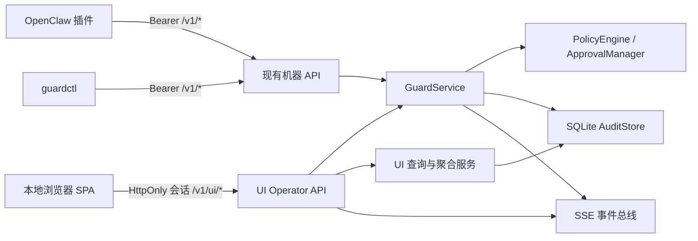
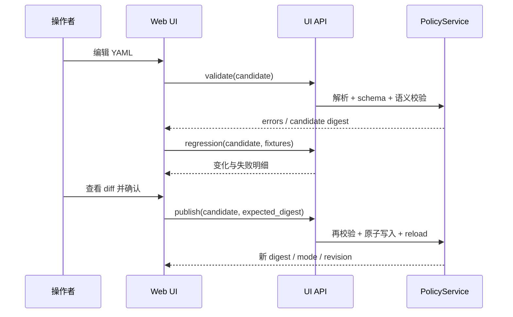

# GuardAgent 可视化管理界面详细实现方案

> 文档状态：首版已实现，作为实现与验收基线
> 基线版本：GuardAgent 0.1.0
> 编写日期：2026-07-16
> 适用范围：本仓库现有 `guardd`、策略文件、SQLite 审计库与 OpenClaw 插件

## 1. 文档目的

本文档描述如何在不破坏现有命令行、OpenClaw 插件和安全边界的前提下，为 GuardAgent 增加本地可视化管理界面。文档覆盖产品范围、技术选型、页面与交互、后端接口、数据结构、安全模型、代码组织、实施阶段、测试和验收标准，可直接作为后续开发依据。

首版已按本文档落地前端、UI API、数据库迁移、安全认证、策略工作台和自动化测试；尚需真实 OpenClaw Gateway 的目标环境验收仍以部署文档为准。

### 1.1 当前实现证据（2026-07-16）

- Python：69 项通过，1 项因 Windows 进程缺少符号链接权限跳过；
- Web：TypeScript 严格检查通过，Vitest 9 项通过，Vite 生产构建通过；
- OpenClaw 插件：TypeScript 严格检查通过，9 项测试通过；
- 最新 Web 构建约 441 KB gzip，七个页面按路由拆分，无 CDN、遥测或远程字体；
- `guardd/ui/static/` 已于 2026-07-16 由当前 `web/` 源码完成生产构建并纳入交付内容；后续修改 `web/src/` 时仍须执行 `cd web && npm run build`；
- 真实 Gateway 联调、3–7 天 Observe 运行和目标主机浏览器验收属于部署门槛，不由仓库自动化测试替代。

## 2. 目标与非目标

### 2.1 建设目标

可视化界面应让本地操作者完成以下工作：

1. 查看 GuardAgent 服务状态、当前模式、策略摘要和风险概览；
2. 实时发现待审批操作，查看脱敏后的上下文并执行“允许一次”或“拒绝”；
3. 检索事件、决策、规则命中、工具结果和会话时间线；
4. 编辑、校验、模拟、发布和回滚当前策略；
5. 运行环境诊断并查看结构化结果；
6. 在界面中理解异常、降级、审计失败和策略生效状态；
7. 保持现有 `guardd`、`guardctl` 和 OpenClaw 插件兼容。

### 2.2 非目标

首个可视化版本不包含：

- 公网部署、多用户账号体系、组织级 RBAC 或远程运维；
- 绕过 OpenClaw 原生审批机制的“永久允许”；
- 任意 SQL 查询、任意本地文件浏览或终端执行；
- 在浏览器中展示未脱敏的原始秘密、完整工具输出或 bearer token；
- 修改 OpenClaw sandbox、exec approvals、操作系统权限等外部安全配置；
- Electron、Tauri 或原生桌面安装包；
- 移除或降级现有 CLI 能力。

## 3. 当前代码基线

### 3.1 已有组件

| 组件 | 当前实现 | 可视化复用方式 |
|---|---|---|
| 服务入口 | `guardd/main.py` 启动 Uvicorn | 同一进程提供 UI 静态资源和 UI API |
| 管理命令 | `guardd/cli.py`，基于 Typer/httpx | 保留 CLI；新增 `guardctl ui` 负责安全打开界面 |
| 机器 API | `guardd/api/app.py` | `/v1/*` 继续服务插件和 CLI，不改变协议 |
| 业务服务 | `guardd/service.py` | 页面和 CLI 共同调用 `GuardService` 能力 |
| 策略引擎 | `guardd/policy/*` | 复用校验、归一化、决策与模拟逻辑 |
| 审批 | `guardd/approvals/manager.py` | 复用一次性审批、TTL、参数绑定和状态机 |
| 审计 | `guardd/audit/store.py` + SQLite | 增加面向 UI 的分页、聚合和详情查询 |
| 诊断 | `guardd/doctor.py` | 改造成后台诊断任务，界面轮询或订阅结果 |
| OpenClaw 插件 | `plugins/guard-openclaw/` | 不承载 UI；继续发送事件并执行判定 |
| 默认策略 | `policies/default.yaml` | 策略编辑器的唯一默认编辑目标 |

### 3.2 当前 CLI 到页面的能力映射

| 现有命令 | 当前 API/实现 | 对应页面 |
|---|---|---|
| `guardctl status` | `GET /v1/status` | 总览 |
| `guardctl events list` | `GET /v1/events` | 事件中心 |
| `guardctl approvals list` | `GET /v1/approvals` | 审批中心 |
| `guardctl approvals allow-once/deny` | 审批解析接口 | 审批详情与操作栏 |
| `guardctl policy validate` | `PolicyLoader` | 策略编辑器“校验” |
| `guardctl policy simulate` | `PolicyEngine` | 策略编辑器“模拟” |
| `guardctl policy test` | fixture + `PolicyEngine` | 策略发布前回归测试 |
| `guardctl replay` | 事件读取 + 当前策略重放 | 会话详情“重放” |
| `guardctl doctor` | `run_doctor` | 系统诊断 |

### 3.3 当前接口能力与缺口

当前 API 已支持健康检查、状态、判定、事件写入和列表、审批、策略校验/模拟/重载，但不足以直接支撑完整界面：

- `/v1/events` 只有 `session`、`risk`、`limit`，缺少游标分页、时间范围、decision、agent、tool、rule 等过滤条件；
- 事件列表返回 `sanitized_json` 字符串，缺少结构化事件详情；
- 没有会话列表、会话详情、趋势聚合、事故列表和策略历史接口；
- 策略校验接口接收文本，但策略重载只从磁盘读取，缺少安全的“校验后原子发布”；
- 策略模拟只能使用当前已加载策略，不能模拟尚未发布的候选文本；
- `run_doctor` 最坏可能连续等待多个外部命令，不能直接阻塞普通 HTTP 请求；
- 服务没有 UI 会话认证、CSRF 防护、实时事件流和静态资源挂载；
- `audit_retention_days` 已配置但当前没有自动清理实现；
- 当前 `reload_policy()` 替换策略引擎，但不会按新策略重新创建关联预算配置，发布策略时应一并修复；
- 当前 SQLite 通过 `CREATE TABLE IF NOT EXISTS` 初始化，没有显式 schema migration 版本管理。

这些缺口应通过扩展后端查询和控制面解决，而不是由浏览器直接读取 SQLite 或策略文件。

## 4. 总体方案

### 4.1 方案选择

采用“FastAPI 同源托管的本地单页应用（SPA）”：

- 前端：React + TypeScript + Vite；
- 数据请求与缓存：TanStack Query；
- 路由：React Router；
- YAML 编辑：CodeMirror 6；
- 图表：ECharts，首期只启用少量柱状图、折线图和环形图；
- 后端：继续使用现有 FastAPI/GuardService/SQLite；
- 生产访问：`http://127.0.0.1:8787/ui/`；
- 开发访问：Vite 开发服务器代理 `/v1/ui/*` 到 FastAPI；
- 构建产物：放入 Python 包内，由 FastAPI 静态资源路由提供。

FastAPI 官方支持挂载静态资源，Vite 官方也提供与传统后端集成的构建方式。参考资料：

- [FastAPI Static Files](https://fastapi.tiangolo.com/tutorial/static-files/)
- [Vite Backend Integration](https://vite.dev/guide/backend-integration.html)

### 4.2 为什么不直接做桌面应用

| 方案 | 优点 | 问题 | 结论 |
|---|---|---|---|
| 本地 Web SPA | 跨平台、与现有 FastAPI 同进程、部署简单、便于测试 | 需要处理浏览器认证与 CSRF | 采用 |
| PySide/PyQt | 原生窗口、无需浏览器 | 新增较重 GUI 依赖，前后端耦合，跨平台打包复杂 | 暂不采用 |
| Electron/Tauri | 桌面体验完整 | 引入独立运行时、打包和升级链路 | 后续可将 Web UI 包装成桌面壳 |
| Jinja/HTMX | 依赖少、服务端渲染简单 | 策略编辑、复杂过滤、实时审批和图表状态管理较弱 | 不作为主方案 |

### 4.3 架构边界



关键原则：

1. 现有 `/v1/*` 机器接口保持 bearer token 认证和协议兼容；
2. 新增 `/v1/ui/*` 操作者接口，使用短期浏览器会话和 CSRF 令牌；
3. 浏览器永远不直接持有 `guardd.token`，也不直接读写 SQLite/策略文件；
4. 所有改变安全状态的动作必须经过后端再次校验；
5. UI 只是控制面，不进入 OpenClaw 插件的判定热路径；
6. UI 不可用时，插件和 CLI 仍然正常工作。

## 5. 用户入口与安全登录

### 5.1 推荐入口

新增命令：

```powershell
guardctl ui
guardctl ui --no-open
```

执行流程：

1. CLI 检查 `GET /v1/health`；
2. CLI 从现有 token 文件读取 bearer token；
3. CLI 调用 `POST /v1/ui/auth/bootstrap` 创建 60 秒、单次使用的随机 bootstrap code；
4. CLI 打开 `http://127.0.0.1:8787/ui/#/bootstrap?code=...`；
5. code 位于 URL fragment 中，不会自动发送到 HTTP 服务或进入访问日志；
6. SPA 将 code POST 到 `/v1/ui/auth/session`；
7. 后端消费 code，设置短期 `HttpOnly; SameSite=Strict; Path=/` 会话 cookie，并返回 CSRF token；
8. SPA 仅在内存中保存 CSRF token，刷新页面后通过 `/v1/ui/auth/session` 恢复会话并轮换 CSRF token。

直接访问 `/ui/` 且没有会话时，只显示“请在本机运行 `guardctl ui`”的引导，不提供 token 粘贴框。

### 5.2 会话约束

- bootstrap code：至少 256 bit 随机数、60 秒过期、只能使用一次；
- UI session：默认 30 分钟无操作过期、最长 8 小时、服务重启全部失效；
- session 和 bootstrap code 首期只保存在服务端内存，不写入审计数据库；
- 每个状态变更请求必须携带 `X-Guard-CSRF`；
- 校验 `Origin`/`Referer`、`Sec-Fetch-Site`，只接受配置的回环 origin；
- 禁止 CORS 通配符，不允许跨站凭据；
- 提供显式退出，立即销毁服务端 session；
- 认证失败、CSRF 失败和 bootstrap 重用写入 `service_incidents`，不记录 code/token。

OWASP 建议不要仅依赖 SameSite，而应结合 CSRF token 和来源校验，本方案按此执行：[OWASP CSRF Prevention Cheat Sheet](https://cheatsheetseries.owasp.org/cheatsheets/Cross-Site_Request_Forgery_Prevention_Cheat_Sheet.html)。

## 6. 信息架构与页面设计

### 6.1 全局布局

```text
┌──────────────────────────────────────────────────────────────────┐
│ GuardAgent  [Observe/Approval/Enforce]   服务状态   待审批(2)  用户 │
├──────────────┬───────────────────────────────────────────────────┤
│ 总览         │ 面包屑 / 页面标题 / 页面级操作                    │
│ 审批中心     │                                                   │
│ 事件中心     │ 主内容区                                          │
│ 会话         │                                                   │
│ 策略         │                                                   │
│ 系统诊断     │                                                   │
│ 设置(只读)   │                                                   │
└──────────────┴───────────────────────────────────────────────────┘
```

全局状态栏必须始终显示：服务在线状态、当前策略模式、策略 digest 短码、数据库完整性和待审批数量。模式颜色只作为辅助，必须同时显示文字和图标。

### 6.2 总览页 `/ui/overview`

#### 内容

- 服务卡片：版本、运行状态、模式、策略版本/digest、工作区、数据库完整性；
- 今日/最近 24 小时指标：事件数、ALLOW、DENY、REQUIRE_APPROVAL、OBSERVE、事故数；
- 风险分布：info/low/medium/high/critical；
- 事件趋势：按 5 分钟或 1 小时聚合；
- Top 规则：命中次数、拒绝次数、最近命中时间；
- 待审批卡片：剩余时间、风险、工具、会话、主要原因；
- 最近高危事件列表；
- 诊断告警：数据库异常、策略文件变化、审计降级、服务 incident。

#### 交互

- 时间范围：1 小时、24 小时、7 天、30 天；
- 点击图表区块跳转到带过滤条件的事件中心；
- 待审批卡片点击进入抽屉详情，不在概览卡片直接允许；
- Observe 模式下明确显示“当前仅记录建议决策，不阻断”，并展示 `would_decide` 分布。

### 6.3 审批中心 `/ui/approvals`

#### 列表字段

- 风险等级、状态、剩余 TTL；
- 工具/动作、目标摘要、agent、session、sender/channel；
- 命中规则、原因、创建时间；
- 审批 ID 短码。

#### 详情抽屉

- 完整脱敏后的 `display_json`；
- 归一化命令、路径、网络目标；
- 参数摘要和 `parameter_digest`；
- 风险、规则、原因和修复建议；
- 关联事件链接；
- 服务端时间与到期时间。

#### 操作规范

- “拒绝”可直接二次确认；
- “允许一次”必须勾选“我已核对工具、目标和参数摘要”，再二次确认；
- critical 风险默认聚焦“拒绝”，允许按钮使用中性样式而非鼓励色；
- 点击后立即禁用两个按钮，等待服务端响应；
- 对 `409 already resolved/expired` 重新拉取记录并显示真实最终状态；
- 倒计时以服务端 `server_time` 校准，不能仅信任本地浏览器时钟；
- 只允许后端返回的 `allowed_decisions`，绝不提供 allow-always；
- OpenClaw 和 UI 可能竞争解析同一审批，后端状态机是唯一事实来源。

审批状态：`pending -> allowed_once -> consumed`，或 `pending -> denied/expired/invalidated_restart`。历史页应保留并区分这些终态。

### 6.4 事件中心 `/ui/events`

#### 过滤器

- 时间范围；
- decision/effective decision/would_decide；
- risk；
- agent、session、tool、event_type；
- rule_id；
- 是否有审批、是否执行成功；
- 关键词只搜索已脱敏的 reason、tool、规则和结构化目标，不搜索原始秘密。

#### 列表与详情

列表使用服务端游标分页，不把全部记录加载进浏览器。默认字段：时间、类型、工具、agent/session、decision、risk、规则、结果。

详情页或抽屉分为：

1. 事件：标识、来源、工具、发生时间；
2. 归一化：actions、commands、paths、network targets、file metrics；
3. 决策：effective/would_decide、risk、规则、原因、策略 digest；
4. 工具结果：success、exit code、duration、脱敏输出摘要；
5. 审批：状态、操作者、耗时、到期时间；
6. 审计：event hash、previous hash、数据分类。

界面不得尝试“还原” `summarize_value()` 处理后的内容；摘要哈希只用于关联和核对。

### 6.5 会话页 `/ui/sessions`

- 会话列表：session 短码、agent、状态、开始/结束时间、事件数、最大风险、拒绝数、待审批数；
- 会话详情：按时间排序的事件时间线；
- 关联统计：工具次数、读写字节摘要、命中规则、风险累计；
- “按当前策略重放”：只计算并展示 recorded vs replayed，不修改历史数据；
- “按候选策略重放”：从策略编辑器进入，使用未发布策略做 dry-run；
- 允许导出脱敏 JSON；默认不支持导出原始 SQLite。

当前 `sessions` 表依赖生命周期事件，查询层应能从 `events` 聚合补全缺失会话，不能假定每个会话都有 start/end 记录。

### 6.6 策略页 `/ui/policy`

#### 页面布局

- 左侧：YAML 编辑器、行号、语法错误标记；
- 右侧：结构化摘要（模式、默认决策、域名、预算、规则数）；
- 下方标签：校验结果、单事件模拟、fixtures 回归、策略差异、历史版本。

#### 安全发布流程



发布必须满足：

1. 后端重新解析和校验，不能信任前端校验结果；
2. 请求携带加载时的 `expected_digest`，防止并发覆盖；
3. 显示 YAML 文本 diff 和结构化安全影响：新增/删除 DENY、审批规则变化、预算放宽、allow domain 变化、模式变化；
4. 切换到 `enforce` 时要求输入 `ENFORCE`，并展示最近一次 doctor 结果；
5. 写入同目录临时文件，flush/fsync 后原子替换；
6. 写入前在 state 目录保存受权限保护的 revision；
7. 重载失败则恢复原文件和原内存策略；
8. 重载成功后同步更新策略引擎、秘密检测规则和 CorrelationEngine 预算；
9. 记录 operator、备注、旧/新 digest、发布时间和结果；
10. 不允许通过 UI 更改 `policy_path` 或打开任意路径。

#### 模拟事件

提供两种输入：

- 从现有审计事件复制一份脱敏事件；
- 使用内置表单构造 tool/event/session/origin/params 测试事件。

模拟结果必须标记为 `dry_run=true`，不得写入正式事件、决策或审批表，不得影响 CorrelationEngine 状态。

### 6.7 系统诊断 `/ui/diagnostics`

- 展示 `run_doctor()` 的每项检查、状态、耗时和脱敏后的截断输出；
- 点击运行后创建后台 job，立即返回 `job_id`；
- 同一时刻只允许一个 doctor job；
- 外部命令继续保留 20 秒单项超时和总时限；
- 浏览器离开页面不取消后端任务；
- 历史只保存最近若干次结构化结果；
- 诊断是只读检查，不在 UI 中自动修复 OpenClaw 或系统配置。

### 6.8 设置页 `/ui/settings`

首期只读展示：host、port、workspace、policy source、state/database 路径、审批 TTL、保留期、插件超时和请求大小限制。明确标注环境变量来源和“修改后需重启”。永不返回 token 内容。

## 7. UI Operator API 设计

### 7.1 接口命名与认证

所有新接口使用 `/v1/ui` 前缀，避免改变插件使用的机器 API。除 bootstrap 创建接口外均要求 UI session；除 GET/HEAD 外均要求 CSRF。

### 7.2 接口清单

| 方法 | 路径 | 用途 |
|---|---|---|
| POST | `/v1/ui/auth/bootstrap` | bearer 认证的 CLI 创建一次性 code |
| POST | `/v1/ui/auth/session` | 消费 code，创建浏览器会话 |
| GET | `/v1/ui/auth/session` | 获取当前会话、CSRF、server_time |
| DELETE | `/v1/ui/auth/session` | 退出 |
| GET | `/v1/ui/overview` | 状态、计数、趋势、Top 规则 |
| GET | `/v1/ui/events` | 游标分页和组合过滤 |
| GET | `/v1/ui/events/{event_id}` | 事件聚合详情 |
| GET | `/v1/ui/approvals` | 审批分页/过滤 |
| GET | `/v1/ui/approvals/{id}` | 结构化审批详情 |
| POST | `/v1/ui/approvals/{id}/allow-once` | 一次性允许 |
| POST | `/v1/ui/approvals/{id}/deny` | 拒绝 |
| GET | `/v1/ui/sessions` | 会话聚合列表 |
| GET | `/v1/ui/sessions/{session_key}` | 会话时间线与统计 |
| POST | `/v1/ui/sessions/{session_key}/replay` | 当前或候选策略重放 |
| GET | `/v1/ui/policy` | 当前原始文本、摘要与 digest |
| POST | `/v1/ui/policy/validate` | 候选文本校验 |
| POST | `/v1/ui/policy/simulate` | 候选策略 dry-run |
| POST | `/v1/ui/policy/regression` | fixtures 或会话回归 |
| POST | `/v1/ui/policy/publish` | 原子发布并重载 |
| GET | `/v1/ui/policy/revisions` | 策略历史 |
| POST | `/v1/ui/policy/revisions/{id}/restore` | 校验后回滚 |
| POST | `/v1/ui/diagnostics/jobs` | 启动 doctor job |
| GET | `/v1/ui/diagnostics/jobs` | 获取最近诊断历史 |
| GET | `/v1/ui/diagnostics/jobs/{id}` | 获取诊断状态/结果 |
| GET | `/v1/ui/incidents` | 服务事故列表 |
| GET | `/v1/ui/settings` | 只读设置 |
| GET | `/v1/ui/stream` | SSE 实时更新 |

### 7.3 通用响应格式

成功列表：

```json
{
  "items": [],
  "next_cursor": null,
  "server_time": "2026-07-15T10:00:00+00:00"
}
```

错误：

```json
{
  "error": {
    "code": "APPROVAL_EXPIRED",
    "message": "Approval has expired",
    "request_id": "...",
    "details": {}
  }
}
```

错误码至少包括：`UNAUTHENTICATED`、`SESSION_EXPIRED`、`CSRF_INVALID`、`VALIDATION_FAILED`、`DIGEST_CONFLICT`、`APPROVAL_EXPIRED`、`APPROVAL_RESOLVED`、`NOT_FOUND`、`JOB_ALREADY_RUNNING`、`INTERNAL_ERROR`。

### 7.4 分页与过滤

- 使用 `(occurred_at, event_id)` 编码的不透明 cursor，不使用大 offset；
- 默认 50 条，最大 200 条；
- 所有时间以带时区 ISO 8601 传输，数据库继续存 UTC；
- 排序字段使用白名单，禁止拼接未校验 SQL；
- 过滤条件使用参数化 SQL；
- `session_key` 等敏感标识列表展示短码，详情接口返回完整哈希标识。

### 7.5 实时更新

SSE 事件类型：

- `approval.created`、`approval.resolved`、`approval.expired`；
- `event.recorded`、`decision.recorded`；
- `policy.reloaded`；
- `incident.created`；
- `diagnostic.completed`；
- `heartbeat`。

SSE 只发送 ID 和最少摘要，前端收到后通过普通 API 重新获取权威数据。支持 `Last-Event-ID`；内存事件环形缓冲只用于短暂重连，服务重启后前端执行全量刷新。断线时审批列表每 2 秒、状态每 10 秒轮询作为降级方案。

## 8. 后端改造设计

### 8.1 新增模块建议

```text
guardd/
├─ api/
│  ├─ app.py                  # 现有机器 API，挂载 UI router/static
│  └─ ui/
│     ├─ router.py            # /v1/ui 路由聚合
│     ├─ auth.py              # bootstrap、session、CSRF、origin
│     ├─ schemas.py           # UI 请求/响应模型
│     └─ errors.py            # 统一错误响应
├─ ui/
│  ├─ static/                 # web 构建产物，禁止手改
│  └─ index.html
├─ query/
│  ├─ dashboard.py            # 聚合指标
│  ├─ events.py               # 事件/会话查询
│  └─ policies.py             # 历史/差异查询
├─ policy/
│  └─ service.py              # 校验、候选模拟、原子发布、回滚
├─ diagnostics/
│  └─ jobs.py                 # doctor 后台任务管理
└─ realtime.py                # 线程安全事件总线/SSE

web/
├─ package.json
├─ vite.config.ts
├─ tsconfig.json
├─ src/
│  ├─ app/
│  ├─ api/
│  ├─ components/
│  ├─ features/
│  │  ├─ approvals/
│  │  ├─ events/
│  │  ├─ overview/
│  │  ├─ policy/
│  │  ├─ sessions/
│  │  └─ diagnostics/
│  ├─ routes/
│  └─ styles/
└─ tests/
```

### 8.2 `GuardService` 重构要求

- 不让 UI router 访问 `store._connection` 或 `_lock`；
- 为状态查询、审批详情、策略发布等提供明确的公开服务接口；
- 把策略 reload 变成单一原子方法，避免文件、内存 engine、secret patterns、correlation budgets 状态不一致；
- 业务状态变更成功提交后再发布实时通知；
- 模拟使用独立 `PolicyEngine` 和事件深拷贝，不污染当前 engine 或 correlation；
- 继续保证高风险审计写失败时 fail closed；
- UI 查询失败不能影响插件判定路径。

### 8.3 `AuditStore` 查询扩展

新增公开方法：

- `list_events_page(filters, cursor, limit)`；
- `get_event_detail(event_id)`；
- `list_approvals_page(...)` / `get_approval_detail(...)`；
- `list_sessions_page(...)` / `get_session_timeline(...)`；
- `overview_metrics(start, end, bucket)`；
- `top_rules(start, end, limit)`；
- `list_incidents_page(...)`；
- `list_policy_revisions(...)`。

建议新增索引：

```sql
CREATE INDEX idx_events_occurred_event ON events(occurred_at DESC, event_id DESC);
CREATE INDEX idx_decisions_risk_created ON decisions(risk, created_at DESC);
CREATE INDEX idx_decisions_kind_created ON decisions(decision, created_at DESC);
CREATE INDEX idx_rule_matches_rule ON rule_matches(rule_id, decision_id);
CREATE INDEX idx_incidents_created ON service_incidents(created_at DESC);
```

新增 `schema_migrations(version, applied_at)`；所有迁移在服务启动、对外监听前执行，并在执行前备份数据库。迁移失败时服务不进入可写运行状态。

### 8.4 策略 revision

新增 `policy_revisions` 表，保存：revision ID、raw YAML、digest、mode、operator、comment、created_at、source digest、发布结果。历史 raw YAML 只保存在权限受限的 state DB 中。现有 `policy_versions` 继续保留审计兼容，不能直接假定其展开后的 `document_json` 可无损恢复原 YAML。

### 8.5 静态资源与 Python 打包

- `web` 构建输出到 `guardd/ui/static`；
- 构建目录包含内容哈希文件名和 manifest；
- Python 包配置显式包含 HTML/JS/CSS/字体等资源；
- `/ui/assets/*` 使用长期 immutable cache；`/ui/index.html` 使用 no-cache；
- SPA 路由 fallback 只作用于 `/ui/*`，不得吞掉 `/v1/*` 的 404；
- 不使用 CDN，所有脚本、样式和字体本地打包；
- 若构建产物缺失，`guardd` 仍启动机器 API，`/ui/` 返回明确的 503，而不是影响插件。

## 9. 前端实现规范

### 9.1 状态管理

- 服务端状态统一由 Query cache 管理；
- 表单临时状态留在组件或 feature store；
- 不在全局 store 复制事件/审批服务端数据；
- CSRF token 只保存在内存；
- 认证过期统一跳到引导页，清空缓存；
- SSE 仅触发精确 cache invalidation。

### 9.2 视觉语义

| 类型 | 颜色建议 | 文本要求 |
|---|---|---|
| info | 蓝灰 | 始终显示 `info` |
| low | 蓝/绿 | 始终显示 `low` |
| medium | 黄 | 始终显示 `medium` |
| high | 橙 | 始终显示 `high` |
| critical | 红 | 始终显示 `critical` |

`ALLOW`、`DENY`、`REQUIRE_APPROVAL`、`OBSERVE` 使用独立标签，不能把 risk 与 decision 混为一类。所有状态同时提供文字、图标和可读辅助说明，不能只靠颜色。

### 9.3 通用交互状态

每个页面必须实现：首次加载 skeleton、无数据状态、筛选无结果、局部刷新、离线/服务不可达、403/409/422/500、重试和会话过期状态。状态变更按钮必须支持提交中禁用，避免双击。

### 9.4 可访问性与本地化

- 默认中文，文案集中管理，为后续英文预留 key；
- 键盘可完成导航、筛选、打开详情和审批确认；
- 对话框具备焦点锁定和关闭后焦点恢复；
- 表格提供可访问名称，图表提供同数据表或摘要；
- 时间默认显示本地时区，同时在 tooltip 展示 UTC；
- 目标达到 WCAG 2.1 AA 的对比度和键盘操作要求。

## 10. 安全设计

### 10.1 必须保持的安全不变量

1. `GUARDD_HOST` 仍只允许 loopback；
2. 机器 API bearer token 不能进入页面源码、URL、localStorage、日志或错误消息；
3. UI 只能展示已经过 `sanitize()`/`summarize_value()` 处理的数据；
4. 一次性审批继续绑定 approval ID、parameter digest、agent、session 和 sender；
5. 浏览器提交的 operator 固定由服务端会话生成，例如 `local-ui:<session-short-id>`，不接受任意 operator 字符串；
6. 所有策略发布、回滚、审批操作写审计；
7. GET/HEAD 不得改变服务器状态；
8. UI/API 异常不能使高风险动作默认允许；
9. 前端校验只改善体验，后端是唯一安全判定者；
10. 不提供“关闭审计”“跳过校验”“永久允许”等界面入口。

### 10.2 HTTP 安全头

对 `/ui/*` 返回：

- `Content-Security-Policy: default-src 'self'; script-src 'self'; style-src 'self' 'unsafe-inline' 'nonce-{request_nonce}'; style-src-elem 'self' 'nonce-{request_nonce}'; style-src-attr 'unsafe-inline'; img-src 'self' data:; connect-src 'self'; object-src 'none'; base-uri 'none'; frame-ancestors 'none'; worker-src 'self' blob:`；其中脚本仍严格禁止 inline/eval，逐请求 nonce 仅供 CodeMirror 动态样式元素使用，`style-src-attr` 仅兼容本地组件尺寸属性；
- `X-Content-Type-Options: nosniff`；
- `Referrer-Policy: no-referrer`；
- `Cache-Control: no-store` 用于认证和敏感 API；
- `Permissions-Policy` 禁止 camera、microphone、geolocation 等无关能力。

生产构建禁止 inline script/eval，若编辑器依赖需要 worker，显式配置本地 worker source 并收紧 CSP。

### 10.3 威胁与缓解

| 威胁 | 缓解 |
|---|---|
| 恶意网页请求 localhost | bootstrap 登录、SameSite Strict、CSRF、Origin/Sec-Fetch 校验、无 CORS |
| token 被浏览器扩展或 XSS 读取 | token 不进入浏览器，session cookie HttpOnly，CSP，无第三方 CDN |
| 审批竞态/重复点击 | SQLite 状态条件更新、409 处理、按钮互斥、以服务端状态为准 |
| 策略并发覆盖 | `expected_digest` 乐观锁、原子替换、revision |
| UI 展示秘密 | 后端只查脱敏字段；前端禁止恢复或请求原始数据 |
| 图表/筛选拖慢判定 | 查询连接/路径隔离、索引、分页、限制时间范围和 bucket 数 |
| 诊断命令拖垮请求线程 | 有界后台 worker、单 job、单项/总超时 |
| 静态资源供应链 | lockfile、固定构建、依赖审计、无运行时外链 |

## 11. 性能与可靠性目标

- 插件判定接口的现有延迟目标不因 UI 查询显著回退；
- UI 常规列表 API 在 10 万事件规模下 P95 小于 500 ms；
- 总览默认 24 小时查询 P95 小于 800 ms；
- 首屏压缩资源建议小于 1.5 MB，策略编辑器和图表按路由懒加载；
- SSE 每个 UI session 只保持一条连接，30 秒 heartbeat；
- 列表最大 page size 200，图表最大数据点 500；
- SQLite busy timeout 延续 5 秒，UI 长查询不得持有写事务；
- 查询失败返回局部错误，不使 `guardd` 进程退出；
- UI 构建缺失、SSE 断线或诊断失败均不影响机器 API。

## 12. 测试方案

### 12.1 Python 单元测试

- bootstrap code 过期、单次消费、重放失败；
- session 过期、退出、CSRF、Origin/Sec-Fetch 校验；
- cursor 编解码、组合过滤、最大 limit；
- 聚合指标和时区边界；
- 事件详情只返回脱敏数据；
- 策略候选校验/模拟不污染运行状态；
- 原子发布、digest 冲突、写失败回滚、reload 失败回滚；
- 策略发布后 correlation budgets 同步更新；
- doctor job 并发限制和超时；
- SSE 缓冲、断线重连和通知类型。

### 12.2 API 集成测试

- 现有 `/v1/*` 测试全部保持通过；
- 无 UI session 的请求为 401；
- 状态变更缺少/错误 CSRF 为 403；
- 浏览器审批与 OpenClaw 审批竞态只产生一个终态；
- expired/restarted/consumed 审批不可再次允许；
- 发布策略产生 revision、policy_versions 和审计记录；
- SPA fallback 不覆盖 API 404；
- 安全头、cookie 属性、缓存头正确；
- 超大请求继续被 413 拒绝。

### 12.3 前端测试

- 组件测试：风险标签、倒计时、审批确认、错误映射、分页筛选；
- 页面测试：overview、events、policy、diagnostics 的 loading/empty/error；
- 策略 diff 和校验错误定位；
- session 过期后缓存清理和重新登录引导；
- SSE 通知触发相应列表刷新；
- 键盘导航、焦点管理和基础可访问性自动检查。

### 12.4 端到端场景

1. `guardctl ui` 创建会话并打开总览；
2. OpenClaw 产生高风险工具调用，审批在 2 秒内出现；
3. UI 允许一次，插件消费审批后状态变为 consumed；
4. 同一审批被 UI 和 OpenClaw 同时解析，界面正确处理 409；
5. 编辑无效策略，发布被禁止且现行策略不变；
6. 发布候选策略，服务不重启即可看到新 digest 和规则效果；
7. 回滚策略，文件、内存策略和 revision 一致；
8. 重启 `guardd` 后旧 UI session 和 pending approval 均失效；
9. SSE 断开后自动轮询，恢复后无重复状态改变；
10. 在事件数据中注入脚本字符串，页面仅作为文本显示且 CSP 阻止执行。

### 12.5 安全回归

- token、私钥、JWT、API key、身份证、银行卡、可选手机号/邮箱不得出现在 API 响应快照；
- XSS payload、CSV/JSON 导出注入、路径穿越、SQL 注入、CSRF 和 localhost drive-by 请求；
- CSP、frame-ancestors、MIME sniffing；
- npm/Python 依赖漏洞检查；
- 现有 adversarial/performance 测试全部通过。

## 13. 分阶段实施计划

### 阶段 0：基线与契约冻结

- 记录现有测试和性能基线；
- 固化机器 API 响应 contract；
- 增加 schema migration 框架；
- 为 UI API 定义 Pydantic schema 和错误码；
- 决定前端依赖并提交 lockfile。

验收：不提供 UI 时，现有 CLI、插件、单元、集成、对抗和性能测试行为不变。

### 阶段 1：只读控制台

- 建立 `web/` 工程和 Python 静态资源打包；
- 实现 bootstrap/session/CSRF；
- 实现总览、事件列表/详情、只读设置；
- 新增分页、聚合和索引；
- 新增 `guardctl ui`。

验收：可安全打开 UI，查询结果与 CLI/SQLite 聚合一致，不能进行状态变更。

### 阶段 2：实时审批

- 审批列表和详情；
- allow-once/deny 操作、确认和竞态处理；
- SSE 事件总线和轮询降级；
- 顶部待审批提醒和服务端校准倒计时。

验收：创建、解析、到期、消费、重启失效的状态均准确，且不出现重复解析。

### 阶段 3：会话与诊断

- 会话聚合、时间线和重放；
- incidents 页面；
- doctor 后台 job；
- 脱敏 JSON 导出。

验收：重放不写历史状态，诊断不会阻塞判定请求。

### 阶段 4：策略工作台

- YAML 编辑、结构化摘要、后端校验；
- 候选策略模拟、fixture 回归和安全影响 diff；
- 原子发布、revision、回滚；
- 修复 reload 后 correlation budget 不同步问题。

验收：任一发布失败路径都保持旧文件和旧内存策略可用；成功发布后所有相关组件使用同一 digest。

### 阶段 5：加固与发布

- E2E、安全、可访问性、性能和大数据量测试；
- 打包验证 Windows/Linux；
- 更新 README、DEPLOYMENT、CURRENT_FEATURES_CN 和运维回滚文档；
- 生成前端 SBOM/依赖清单；
- Observe 模式真实环境试运行后再验证 Approval/Enforce。

## 14. 验收标准

### 14.1 功能验收

- 本机通过 `guardctl ui` 打开界面，无需复制 bearer token；
- 七个主要页面均具备 loading、empty、error 和刷新状态；
- 事件、会话、审批、规则和指标之间可相互跳转；
- 审批支持且只支持 allow-once/deny；
- 策略可校验、模拟、回归、发布、查看历史和回滚；
- doctor 可运行并显示结构化结果；
- CLI 和插件保持可用。

### 14.2 安全验收

- UI 仅绑定回环地址；
- bearer token 不出现在浏览器存储、URL、页面源码、控制台和网络响应；
- 所有状态变更均验证 UI session、CSRF 和来源；
- 所有展示/导出数据均脱敏；
- 策略发布与审批均有审计；
- 页面不存在永久允许、任意文件访问或任意命令执行能力；
- UI 故障不改变 fail-closed 规则。

### 14.3 兼容性验收

- `guardd` 与 `guardctl` 原命令保持兼容；
- OpenClaw 插件不需要为 UI 修改消息协议；
- 旧数据库可自动备份并迁移；
- UI 静态资源缺失时机器 API 正常；
- Windows PowerShell 和 Linux shell 环境均能启动与打开界面。

## 15. 发布、迁移与回滚

### 15.1 数据库迁移

1. 停止接受新的 UI 写操作；
2. 对 SQLite 主库、WAL、SHM 做一致性备份；
3. 在事务中执行 migration；
4. 运行 `PRAGMA integrity_check`；
5. 成功后记录 migration 版本并启动服务；
6. 失败则恢复备份并拒绝以不完整 schema 运行。

### 15.2 应用回滚

- 前端是 Python 包内静态资源，随 Python 包版本一起回滚；
- 数据库迁移优先设计为向后兼容的增表/增索引；
- 回滚旧程序前检查其是否能忽略新增表；
- 策略 revision 独立于前端版本，可手动恢复最后已知有效 YAML；
- UI 可通过配置开关禁用，但机器 API 默认继续运行；
- 出现控制面故障时使用现有 CLI 完成 status、events、approvals 和 policy 操作。

## 16. 风险清单

| 风险 | 影响 | 处理 |
|---|---|---|
| 浏览器本地服务攻击面扩大 | 高 | 专用 UI session、CSRF、来源校验、CSP、回环绑定 |
| SQLite 聚合影响判定延迟 | 高 | 索引、分页、短查询、查询服务隔离、性能门槛 |
| 审批 TTL 短导致操作体验差 | 中 | SSE、服务端倒计时、醒目提醒；不擅自延长 TTL |
| 策略编辑误放宽安全边界 | 高 | 安全影响 diff、回归、明确确认、revision、原子回滚 |
| 前端依赖供应链 | 中 | 最小依赖、lockfile、无 CDN、审计和 SBOM |
| UI 与 CLI 状态含义不一致 | 中 | 共用服务层和 schema contract，不在前端复制判定逻辑 |
| 旧数据缺少完整 session 生命周期 | 中 | 从 events 聚合补全并标记推断状态 |
| 历史 policy_versions 无法恢复原 YAML | 中 | 新增 raw revision，旧记录只读展示 |

## 17. 开发约束与完成定义

每个阶段的 PR 应满足：

- 不直接修改 `guardd/ui/static` 生成文件之外的构建产物；
- 新 API 有 Pydantic 请求/响应模型和 OpenAPI 描述；
- 新 SQL 有参数化查询、索引评估和大数据量测试；
- 新状态变更有审计、错误码、幂等/冲突行为；
- 前端不包含安全判定逻辑，只展示后端结果；
- 无外部 CDN、遥测或远程字体；
- Python、TypeScript、前端组件和 E2E 测试通过；
- 文档与实际命令、页面、API 一致；
- 在 Observe 模式完成真实 OpenClaw 联调并记录证据。

## 18. 建议的默认决策

为减少实施时反复决策，首版采用以下默认值：

- UI 路径：`/ui/`；UI API：`/v1/ui/*`；
- 前端：React + TypeScript + Vite；
- 默认语言：简体中文；
- 默认主题：跟随系统，提供明暗切换；
- 默认总览范围：24 小时；
- 默认列表页大小：50；最大 200；
- 审批刷新：SSE，失败后 2 秒轮询；
- 状态刷新：SSE，失败后 10 秒轮询；
- UI idle session：30 分钟；绝对上限 8 小时；
- bootstrap code：60 秒、单次使用；
- 浏览器不保存 bearer token 或 CSRF token；
- 策略发布必须有 digest 乐观锁、revision 和原子替换；
- 第一版不做远程访问、多用户和永久授权。

以上默认决策若无新的产品约束，可直接进入阶段 0/1 实施。
